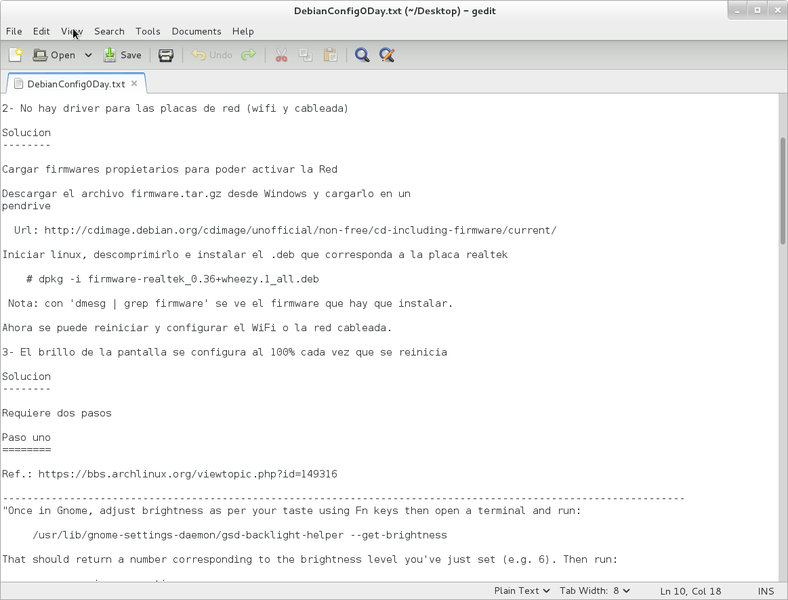

基础应用
=======

## 查看文件内容
经常我们会在终端里查看一个文本文件的内容，这些文本文件可能是源代码，可能是配置文件。查看文件内容是一个**读操作**，在Windows下面我们通常是采用记事本或者其他代码编辑器来查看文件的内容的，文本编辑器除了读的功能外，还免费赠送了一个**写**的操作，即我们可以一边查看一边修改。

Ubuntu下最简单易用的文本编辑器应该是系统自带的 [gedit](https://apps.ubuntu.com/cat/applications/gedit/)，可以通过程序菜单启动，然后打开和编辑代码，也可以从命令行使用`gedit + 文件名`的方式打开文本文件。



通常gedit之类的类似于Notepad++的文本编辑器能够满足基本的代码编辑，如果需要提高代码编辑效率，可以了解Vim、SublimeText、Atom等文本编辑器。后面我们会专门用一次课来讲Vim和Atom的基础配置和使用。

在很多时候，我们只是想看看文件的内容而已，并不想修改它。这个时候可以使用`cat`程序，例如
```bash
$ cat ~/.profile
```

如果我们想一页一页地查看文本文件，别忘了“系统维护”一节的`more`和`less`程序！在查看比较长的文件时，我们更多地使用`less`来查看。
```bash
$ less ~/.profile
```

**建议**:当我们和文件打交道(特别是系统文件)时，我们最好先想清楚是不是想修改它们！如果不修改它们，最好用`less`而不是用一个文本编辑器来打开，从而避免不小心修改了重要的文件。使用Linux时，**安全应该随时作为行为准则!**

## 切换目录
Linux使用`cd`来切换目录，这个指令一定不陌生了，只要在它后面加上路径就可以实现路径的切换。所以了解切换目录相关的操作时，更多地需要了解路径的规则。

在上一节已经基本了解根目录`/`下面的目录结构，其实际上就是一个树结构，当给定一个路径(如`/usr/local/bin`)时，每次使用`/`表示往树的子节点走，解析路径本质上是在查找树内进行查找的操作。因为`/`是**唯一**的，所以将诸如`/usr/local/bin`类型的路径称为**绝对路径**，使用绝对路径不容易出错，但是在目录较深时不太方便。

除了绝对路径之外，我们还接触过没有加`/`的情况，这个时候表示查找路径时总是从当前所在的目录开始往下查找。例如在自己的家目录下面，`Downloads/apps/chrome.deb`表示在自己的家目录里面首先查找`Downloads`，然后再继续往下查找。这类依赖于当前所在目录的路径类型，称为**相对路径**。Linux提供了`.`和`..`来表示当前目录和父目录，例如
```bash
$ cd ..
```
可以到达父目录。另外`.`也有其用处，例如使用gcc不加参数地编译一个C程序后，会在当前目录生成`a.out`二进制文件，这时候可以使用
```bash
$ ./a.out
```
执行，表示执行的是当前目录的`a.out`。

`.`和`..`在html文件中也时常会出现，可以找几个网站的html文档看看。

## 查看内容
在"文件系统"一节我们已经知道，`ls`是用来查看目录内容的指令，我们通常会加上不同的参数来配置其输出选项，我们还在`.zsh_aliases`文件中配置了常用的别名用来简化其使用，因为它的使用确实太高频了。

除了想知道目录里有什么文件外，我们还想知道一个文件或目录的详细信息，通常`ll`就能输出关于目录和文件的额外信息。此外，我们还常用`file`指令来查看文件或目录的详细信息
```bash
$ file Documents
Documents: directory
```
表示`Documents`是一个目录。
```bash
$ file .profile
.profile: ASCII text
```
表示`.profile`是一个用ASCII编码的文本文件。

## 创建目录
Linux使用`mkdir`指令来创建一个目录，例如在当前目录创建`Pictures`目录
```bash
$ mkdir Pictures
```
也可以一次性创建多个目录，只需要用空格分开多个目录名字就行了
```bash
$ cd Pictures
$ mkdir spring summer fall winter
$ ls
fall  spring  summer  winter
```
也可以在其它目录中创建目录，只需要给出目录就行
```bash
$ mkdir ~/Downloads/tmp
```
但是注意创建目录所在的父目录一定要存在，例如
```bash
$ mkdir ~/Music/TaylorSwift
mkdir: cannot create directory '/home/guanhao/Music/TalorSwift': No such file or directory
```
报错提示没有`~/Music`目录，这个时候可以加上`-p`参数，表示自动地创建所需要的目录
```bash
$ mkdir -p ~/Music/TaylorSwift
$ ls ~/Music
TalorSwift
```

## 移动和重命名
Linux使用`mv`指令来移动文件或目录，使用方法是`mv`+`源`+`目标`，表示将源移到目标位置，例如
```bash
$ cd
$ mkdir KatyPerry
$ mv KatyPerry Music/KatyPerry
$ ls Music
KatyPerry TaylorSwift
$ mv Music/TaylorSwift Music/Coldplay
$ ls
KatyPerry
```
注意到并没有把`TaylorSwift`移动到其它地方，或者说把它移动成了Music下面的Coldplay，这实际上是重命名操作。移动和重命名本质上可以归为一类操作。

## 拷贝文件
使用`cp`来完成拷贝文件创建副本的操作，和`mv`类似，也是+源+目标的方式，不过注意在拷贝文件夹时需要加上`-r`选项来表示拷贝的是文件夹而不是文件。示例
```bash
$ cp Music/Coldplay . -r
$ cp .profile .profile_backup
```

## 删除
使用`rm`来删除目录和文件，注意删除文件夹时需要加上`-r`选项。示例
```bash
$ rm Music -r
$ rm .profile_backup
```

## 总结
了解了本节的指令并使用熟练后，我们已经能够在Linux下面自由地操控目录和文件了，实际上，在了解目录结构并配合`Tab`键自动补全的功能特性后，在命令行下面进行文件和目录操作的效率是远高于在可视化的文件管理器内进行相同操作的。下一节我们会介绍一些更高级的特性，进一步提升效率！

## Problems
1. 尝试对各种类型的文件(图片，excel文档，word文档，电影等)使用`file`指令来查看其信息。
2. 在Music目录里面使用`chmod -w *`修改目录为只读文件，然后使用`rm -r KatyPerry`试试能不能删掉？加上`-f`参数呢(`rm -rf KatyPerry`)?
