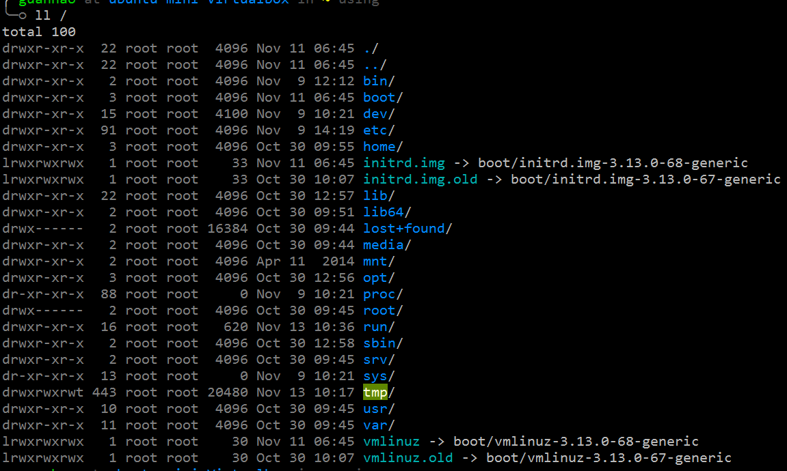

文件系统
=======

本节介绍Linux的文件系统，概览根目录`/`下的目录和文件，简要说明它们分别是干什么的。

## 根目录
打开Ubuntu终端，输入
```bash
$ ll /
```
`ll`是`ls -alF`的别名，在`~/.zsh_aliases`里面定义，这个文件是之前配置`OnceCLI`时创建的文件，可以看到定义的其它的别名。这个命令以详细列表的形式列举了根目录`/`下面的文件夹。



注意到第一列表示的是文件或文件夹的**属性字段**，由10个字符组成：第一个字符`d`表示目录，`l`表示链接，`-`表示普通文件。后面9个字符分为三组，分别表示:所有者许可权、群组中其它所有者许可权，其余用户的许可权。许可权由`rwx`三个字母组成，`r`表示可读，`w`表示可写，`x`表示可执行，`-`表示无该权限。

关于`ls`的更多细节，参考: [IBM Knowledge Center - 显示目录的内容](http://www-01.ibm.com/support/knowledgecenter/ssw_aix_71/com.ibm.aix.osdevice/cmd_display_dir_content.htm?lang=zh)。

目前需要关注的是根目录下面存放了哪些目录。根目录`/`下面的目录组织结构大概如下图所示，不同Linux发行版之间略有差异，但大体相同。


这即是所谓的Linux文件系统，根目录下面的目录各有用途，其大概说明如下表

|目录|内容|
|:---|:---|
|/bin|可执行程序，由系统、管理员和普通用户共享|
|/boot|系统启动引导文件|
|/dev|外围设备文件|
|/etc|配置文件|
|/home|存放用户目录|
|/initrd|启动时的一些初始化操作|
|/lib|库文件|
|/lost+found|系统异常时保存的文件存放地方|
|/mnt|挂载外部文件系统|
|/opt|一些第三方(非开源)的授权软件|
|/proc|存储进程信息的虚拟文件系统|
|/root|超级用户的家目录|
|/sbin|系统和管理员独享的可执行程序|
|/tmp|存放临时文件，重启清空|
|/usr|用户相关的可执行程序、头文件和库文件|
|/var|存放日志文件和临时下载文件等|

下面介绍几个接触比较多的目录。

## 家目录`/home`
使用`ls /home`可发现下面存储了一个和自己用户名相同的目录
```bash
$ ls /home
guanhao
```
这个目录就是我们在Ubuntu的文件管理器里默认打开的目录，或者说在终端启动时默认所在的目录，里面存放的都是用户自己的一些文件，所以称为**家目录**。启动一个终端，输入
```bash
$ cd /home/guanhao
```
会发现zsh的命令行提示符显示的当前目录并没有发生变化，也就是说`/home/guanhao`确实是自己的家目录。Ubuntu会默认在相应用户的文件夹，例如`Downloads, Documents`等等。`~`可以替代当前用户的家目录，比如使用
```bash
$ cd ~
```
可以在任何时候直接回到自己的家目录。zsh的命令行提示符会贴心地提示当前所在的目录。输入
```bash
$ ll ~
```
会发现除了在文件管理器里可以看到的文件夹之外，还存在一些文件或文件夹是以`.`开头的，这是Linux的隐藏文件夹或者隐藏文件。Linux把隐藏文件用开头的`.`表示，即`.`开头的文件或文件夹默认都是隐藏的。用户自定义的配置(如zsh,bash,tmux,vim等)通常会放在自己的家目录里面，而为了不干扰用户工作，通常会将这些配置文件设置为隐藏文件。所以配置文件又称为 **dotfiles**。

## 配置文件`/etc`
另外一个比较重要的目录是`/etc`目录，下面存放的是程序的配置文件(全局)，例如
* `/etc/apt/sources.list`: APT包管理器的软件源列表
* `/etc/ssh/sshd_config`: ssh-server的配置文件

这些文件夹我们之前已经接触过，他们的作用就是存放配置文件。配置文件本质上是文本文件，文本文件中的内容设定了程序运行的选项，规定程序的运行方式等。当我们安装了新软件并且需要配置时，通常会修改`/etc`目录下面相应的配置文件。

## 用户的目录`/usr`
还有一个重要的目录是`/usr`，存放的是用户级别的相关文件，Linux将和系统层面以及管理员层面相关的可执行文件、头文件、库文件等放在了`/bin,/sbin,/lib/`等文件夹中，而将用户安装的程序、头文件、库文件通常归档到`/usr`目录下。打开终端，输入
```bash
$ which zsh
$ which python
```
会发现输出都表明`zsh`和`python`所在的目录都在`/usr/bin/`下面，而不是`/bin`或`/sbin`下面。

## 环境变量
打开终端，输入
```bash
$ echo $PATH
/home/guanhao/bin:/usr/local/bin:/usr/local/sbin:/usr/local/bin:/usr/sbin:/usr/bin:/sbin:/bin:/usr/games:/usr/local/games
```
输出了一系列一系列`bin`或`sbin`目录。Linux执行指令时总是从`$PATH`中存储的路径里去搜索二进制程序，这和Windows的环境变量的机制是完全一致的。

要修改环境变量，比如将某个目录添加到`$PATH`，可以使用
```bash
$ export PATH=$PATH:/home/guanhao/anaconda/bin
```
添加了`/home/guanhao/anaconda/bin`到环境变量，注意之前还有`$PATH:`这一部分，表示将目录附加到原来的环境变量后面，而不是直接覆盖原有环境变量。环境变量的字符串使用`:`来分隔不同的路径，所以需要在`$PATH`后面加一个`:`。

但是上面的方式在下次注销后将会失效。要永久地修改环境变量，需要对配置文件`.profile`进行修改。输入
```bash
$ cat .profile
```
注意最后三行，表示若用户的目录存在`bin`目录，则将其添加到环境变量，修改的语法是直接对`PATH`进行赋值操作
```bash
    PATH="$HOME/bin:$PATH"
```
注意使用到了另一个变量`$HOME`，表示自己的家目录，可以输入
```
$ cd $HOME
```
试试。

修改配置文件来达到修改环境变量的目的，可以使得设置的环境变量在重启机器后仍然生效。

**建议**:手动修改和维护环境变量是比较复杂的事情，**如非必要，尽量不要手动修改环境变量**！

## Problems
1. 这一节只详细介绍了常用的几个文件夹，事实上了解这几个文件夹的作用暂时已经足够，如需进一步了解Linux文件系统的更多细节，建议参考: [Linux Directory Structure and Important Files Paths Explained](http://www.tecmint.com/linux-directory-structure-and-important-files-paths-explained/)。

2. 阅读一下`.profile`的其余内容，理解一下其余的代码做了什么。**阅读和理解代码是最好的学习方式!**

3. 在命令行里输入`echo $SHELL`查看输出，想一想`$SHELL`这个变量表示什么意思？Linux之中还存在其他类似的变量吗，找找看。
