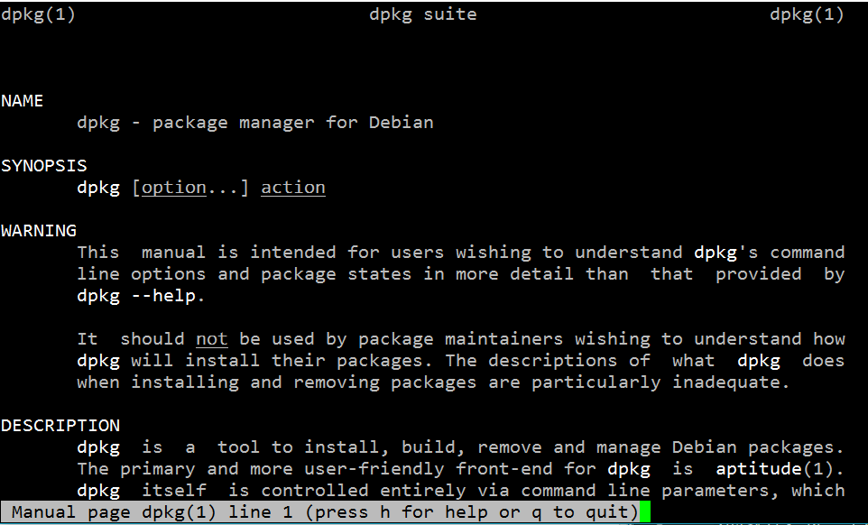
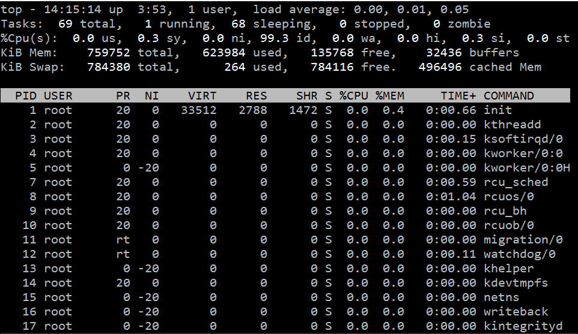
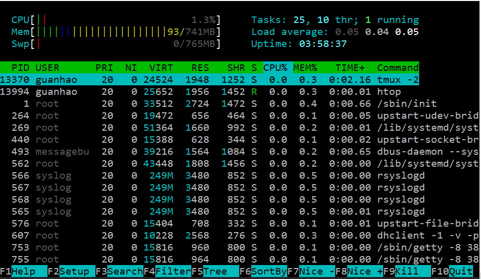
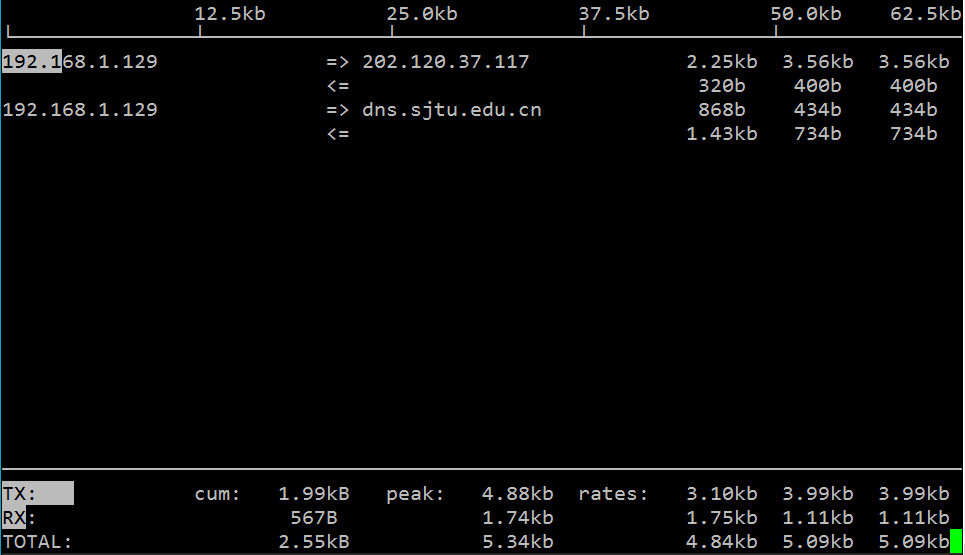

Linux系统维护
============

## 管理软件
Windows下面，当我们需要安装新软件时，通常需要经过如下流程
> 下载安装包 -> 双击安装包 -> 接受用户协议 -> 安装 (-> 破解激活)

本质上安装程序将一些文件解压到 `C:/` 下面的 `Program Files` 文件夹，然后再注册表里面插入一些键-值。某些情况下软件不会安装到 `Program Files`文件夹，这时候需要将环境变量添加到系统的 `$PATH` 里面，让操作系统找得到二进制文件的位置。

当我们要卸载软件时，我们需要
> 启动卸载程序 -> 确认卸载

将删除程序的文件，比较规矩的程序会删除掉自己当初创建的注册表，并还原系统环境变量。

在 Linux 下面，要安装程序，我们也要进行类似的操作：
1. 解压二进制文件，若没有，则从源代码编译二进制文件
2. 拷贝二进制文件到`/usr/bin`、`/usr/local/bin`等存放二进制文件的地方，这样系统就能找到程序
3. 拷贝程序配置文件到 `/etc/`下面，配置文件决定了程序运行的状态

Linux下面也可以通过下载安装包进行软件安装的方式，通常提供的安装包后缀是 `*.rpm` 或者 `*.deb`，前者是 RHEL/Centos/Fedora 使用的格式，后者是 Debian/Ubuntu/Linux Mint 等使用的格式。在Ubuntu下面，下载deb包后双击安装即可打开系统的软件商店，并安装程序。事实上，rpm和deb都是Linux系统的**包管理器(Package Manager)** 提供的软件安装包的文件格式。包管理器，即用来管理软件(包)的软件，形象地说，相当于Windows上的360软件管家(虽然这个形容有点给包管理器掉分==!)。每一个Linux发行版都会提供一套完备的包管理器，本节我们主要讨论 Ubuntu 下面使用包管理器进行软件的管理和维护。

关于包管理器更详细的描述，参考: [Package Manager - Wikipedia](https://en.wikipedia.org/wiki/Package_manager)。

### dpkg 包管理器
最初在类unix系统上安装软件，只有.tar.gz的打包文件，用户必须编译每个他想运行的软件。用户们普遍认为系统很有必要提供一种方法来管理这些安装在机器上的软件包，当Debian诞生时，这样一个管理工具也就应运而生，它被命名为dpkg。从而著名的“package”概念第一次出现在GNU/Linux系统中，稍后Red Hat才决定开发自己的“rpm”包管理系统。

dpkg- Debian 包管理工具，用于安装、构建、删除和管理 Debian 软件包。dpkg 需要执行何种操作，取决于执行`dpkg`命令时附带的参数。

以搜狗输入法for linux为例，首先我们下载安装包` sogoupinyin_2.0.0.0066_amd64.deb`，然后演示其安装和删除操作。

**安装软件包**:
```bash
$ sudo dpkg -i sogoupinyin_2.0.0.0066_amd64.deb
$ sudo apt-get install -f
```
将安装搜狗输入法，正如之前说的，第二行指令是为了安装搜狗输入法依赖的其它软件包。

**查看安装的软件**:
```
$ dpkg -l | sogou
ii  sogoupinyin                          2.0.0.0068                              amd64        Sogou Pinyin Input Method
```
将列出上一步安装的搜狗输入法，其名字是`sogoupinyin`，版本号`2.0.0.0068`，软件架构是`amd64`，软件描述 - Sogou Pinyin Input Method。注意此处用到了管道`|`和查找命令`grep`，后面会详细讲。

**删除软件包**:
```bash
$ sudo dpkg -r sogoupinyin
(Reading database ... 108459 files and directories currently installed.)
Removing sogoupinyin (2.0.0.0068) ...
...
```
将删除软件包`sogoupinyin`，使用`-P`参数可以更彻底地删除
```bash
$ sudo dpkg -P sogoupinyin
(Reading database ... 108169 files and directories currently installed.)
Removing sogoupinyin (2.0.0.0068) ...
...
```
打开Ubuntu的终端，输入
```bash
$ dpkg --help
```
会弹出关于dpkg的帮助文档，可以看到上面演示的指令在帮助中都有说明，还包括一些没有提及到的参数选项，当然目前或今后都可能不会用到这些选项。**养成阅读--help文档的习惯非常重要**。

除了程序本身的帮助文档以外，还可以使用
```bash
$ man dkpg
```



查看dpkg的**用户手册(manual)** ，默认会用`less`程序打开用户手册，用`f`向下翻页，用`b`向后翻页，点`q`退出。`less`是一种终端文本文件查看器，是`more`的加强版本，更多关于`less`和`more`的有趣细节，参考：
1. [What are the differences between most, more and less?](http://unix.stackexchange.com/questions/81129/what-are-the-differences-between-most-more-and-less)
2. [less is more? Is more less? I'm so confused](http://superuser.com/questions/310137/less-is-more-is-more-less-im-so-confused)

总之，**在遇到陌生的程序时，尝试`--help`或者`man`是非常好的习惯，也是了解一个程序的最佳实践**。新手可以安装中文的manual来降低阅读难度，参考: [Ubuntu 里使用中文 Man](http://wowubuntu.com/cn-man.html)，但是需要注意的是中文manual更新缓慢，如果英文阅读没有问题，建议始终阅读英文的manual。

### APT 软件包管理
在dpkg诞生后，用户和开发者又有了新的需求，他们需要一个快速、实用、高效的方法来安装软件包，当软件包更新时，这个工具应该能自动管理关联文件和维护已有配置文件。Debian再次率先解决了这个问题，**APT(Advanced Packaging Tool)** 诞生了。APT后来还被Conectiva改造用来管理rpm，并被其它Linux发行版本采用为它们的软件包管理工具。简单来说，APT提供了更加用户友好的软件包管理体验。

打开Ubuntu终端，输入
```bash
$ cat /etc/apt/sources.list
```
可以看到我们之前配置的**软件源**列表，APT根据这些远程的源镜像来建立和维护本地的软件包信息缓存，安装、更新、卸载等操作都通过管理和维护这些文件快速完成。

目前最流行的APT用户前端包括:
* apt-get - APT 的命令行前端
* aptitude - APTde 的高级命令行前端
* synaptic - 图形界面的APT前端

我们专注于使用命令行下的工具，即`apt-get`和`aptitude`。后者本身定位是相对于`apt-get`更加高级和友好的包管理，更多的时候我们只涉及到安装和删除软件包的操作，`apt-get`显得更常出现。实际上有时还需要从软件仓库中查找软件包，需要`apt-cache`来完成，`aptitude`相当于封装了`apt-get`和`apt-cache`的功能，并且简化了一些操作的概念。推荐日常更多地使用`aptitude`。

关于`apt-get`和`aptitude`的更多细节，参考:
* [What's difference of apt-get and aptitude? ](http://askubuntu.com/questions/347898/whats-difference-of-apt-get-and-aptitude)
* [What is the real difference between “apt-get” and “aptitude”?](http://unix.stackexchange.com/questions/767/what-is-the-real-difference-between-apt-get-and-aptitude-how-about-wajig)

下面介绍`aptitude`的基础使用。

**搜索软件**:

使用`aptitude search` 加上搜素关键字来在仓库中搜索软件，例如，
```bash
$ aptitude search git-core
```
将会返回搜索结果和软件包描述。

**安装软件**:

使用`sudo aptitude install` 加上软件包名字来安装新软件，例如，
```bash
$ sudo aptitude install git-core
```

**更新软件仓库**:
```bash
$ sudo aptitude update
```

**更新软件/系统**:

提供了`safe-upgrade`和`full-upgrade`两种升级策略，前者更保守。
```bash
$ sudo aptitude full-upgrade
```

**卸载软件**:

通常采用
```bash
$ sudo aptitude remove git-core
```
卸载软件，将remove替换成purge，将进行更彻底的删除。

上面的指令能满足日常的软件管理需求，如需进一步了解，还是先前那句话，多`man`一下！

关于Debian及其衍生版(Ubuntu等)系统的软件包管理的更多细节，参考: [Debian快速参考手册 - Debian 软件包管理](http://qref.sourceforge.net/Debian/quick-reference/ch-package.zh-cn.html)

总结在Ubuntu下的软件安装策略:
1. 首选从软件仓库安装软件，方便维护
2. 仓库里不存在的(比如Chrome)，到软件提供商的下载链接下载`*.deb`文件然后使用`dpkg -i`安装
3. 目前Ubuntu流行的PPA安装方式，参考:[PPA - Wikipedia](https://en.wikipedia.org/wiki/Personal_Package_Archive)

## 磁盘管理
因为**Evertthing is a file.** ，Linux下面管理和访问磁盘，也离不开其文件系统。首先打开Ubuntu终端，输入
```bash
$ df -h
```
仔细阅读输出的每一列及其含义，注意到最后一列`Mounted on`，下面对应了文件系统中的位置，例如`/,/sys/fs/cgroup,/dev`等。我们目前只需要关注`/`对应的文件系统，通常是`/dev/sda1`(按照之前介绍用虚拟机安装Ubuntu的话)，表示磁盘的分区本来是放置在`/dev`目录下的，这个目录下还放有系统的其它设备，用
```bash
$ ls /dev
```
可以查看`/dev`下的文件，分别对应了不同的硬件设备。

在`/dev`里找到磁盘分区`/dev/sda1`还不够，我们还需要将其挂载到文件系统中，例如将`/dev/sda1`挂载到`/`，根目录下面的东西才能够放置到`/`目录下，即通过文件树的结构来组织文件和目录。

使用`man  mount`查看`mount`的manual，回顾我们当初是怎么挂载虚拟机的共享目录的，`-t`后面指定的类型是`vboxsf`，是VirtualBox提供的共享磁盘类型，日常我们接触更多的是`ntfs-3g,fat32,ext2`等文件系统类型。

## 负载监视
Linux提供了很多命令行负载监视软件，相当于Windows的任务管理器，下面介绍推荐的几款负载监视软件。

### 系统负载
最常用的命令是`top`，一般发行版均自带了这一指令。
```bash
$ top
```



Ctrl+C或q可以退出程序，关于top的细节，参考`man top`。`htop`提供了更友好和漂亮的界面，使用
```bash
$ sudo aptitude install htop
```
安装程序，然后运行
```bash
$ htop
```



### 网络负载
使用`iftop`程序可以监视系统的网络负载，使用`sudo aptitude install iftop`安装，`sudo iftop`运行



到了这一步，我们会发现，使用Linux并不是那么难，我们使用的软件都会有详尽的配套手册，运行程序加上合适的参数就可以达到目标期望。所以再强调重要的原则:
1. 使用`--help`
2. 使用`man`

## Problems
2. 简要阅读`dpkg`、`less`、`more`、`apt-get`、`aptitude`的manual
1. 当我们使用命令行参数是，有的是一道杠`-`，有的是两道杠`--`，搜索一下，这两种参数表示方法有什么区别？
3. 参考[关于 PPA 及如何通过 PPA 源来快速安装软件](http://wowubuntu.com/ppa.html)，然后用PPA方式安装一个软件。
