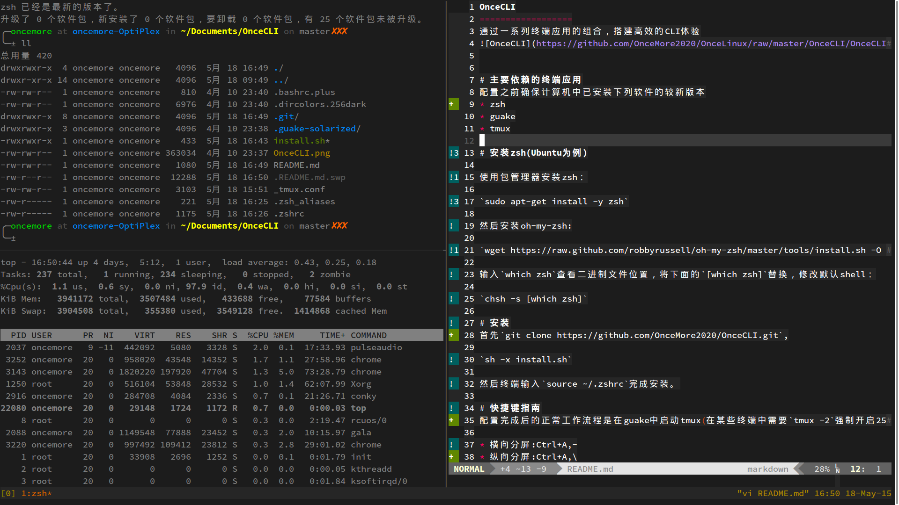
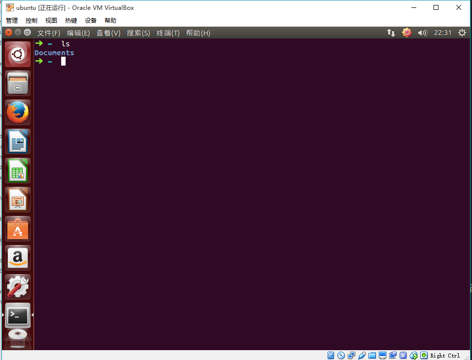
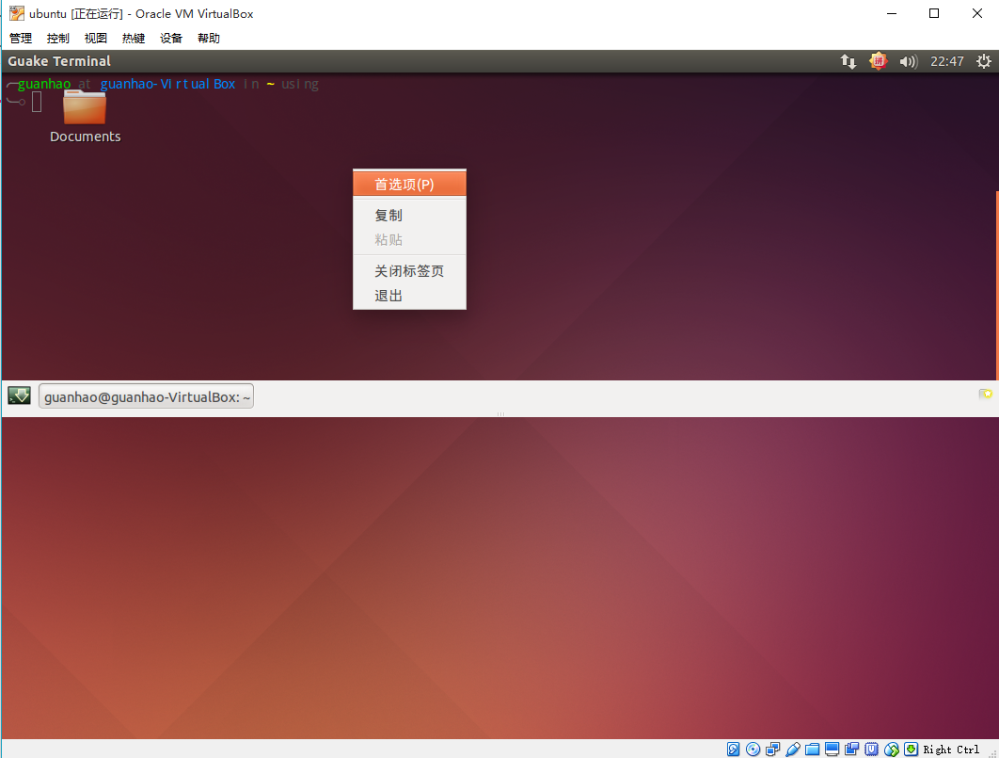
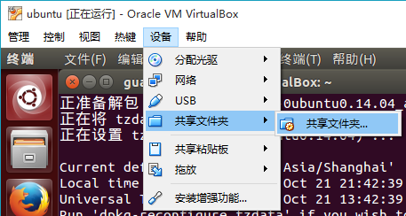
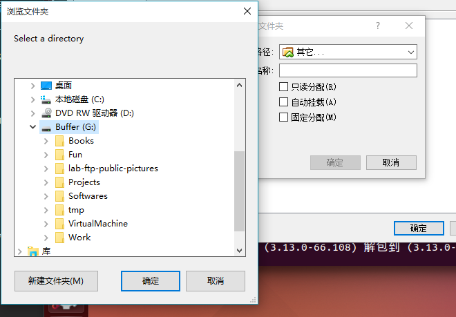
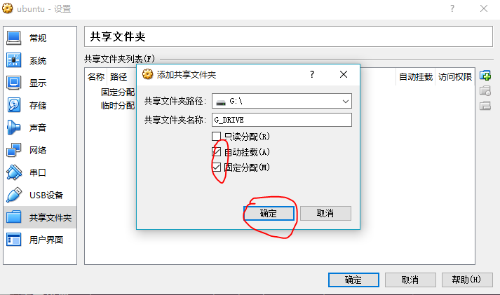
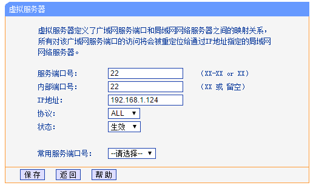
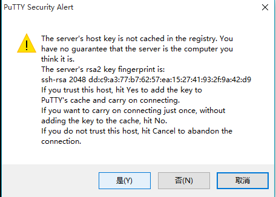
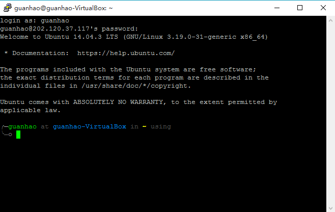

使用前的配置
===========

## 更好用的终端
介绍高效的终端工具组合，包括:
* guake
* zsh
* tmux

通过这些工具的组合，并搭配适当的配置文件，能够大幅提升工作效率和逼格



首先安装guake,zsh和tmux
```bash
$ sudo apt-get install -y guake zsh tmux
```

安装git
```cpp
$ sudo apt-get install -y git
```

安装oh-my-zsh
```bash
$ sh -c "$(wget https://raw.github.com/robbyrussell/oh-my-zsh/master/tools/install.sh -O -)"
```

[zsh](http://www.zsh.org/)是一种类似于bash的shell脚本语言，提供了更友好和高效的特性，[on-my-zsh](https://github.com/robbyrussell/oh-my-zsh)是社区的一帮人开发的zsh配置文件。目前不需要知道它们为什么比默认的终端模拟器更好，通常最直观的感觉是他们让终端更好看了;-)。

修改默认shell：
```bash
$ chsh -s /usr/bin/zsh
```
ubuntu安装zsh默认是在`/usr/bin/zsh`，对于其它的linux发行版，可能会安装到其它位置，更妥当的方法是使用
```bash
$ chsh -s $(which zsh)
```
这样将会把`which zsh`的输出作为参数传递给`chsh`。

这个时候，注销并再次登录，打开终端



首先会发现命令提示符变得更加炫酷了，现在我们做一些额外的配置，让其更炫酷

安装git并从github仓库克隆配置文件
```bash
$ git clone https://github.com/OnceMore2020/OnceCLI.git
```

进入OnceCLI文件夹并执行安装脚本
```bash
$ cd OnceCLI
$ sh -x install.sh
```

然后终端输入
```bash
$ source ~/.zshrc
```
完成安装。

[guake](http://guake.org/)是一个响应式的终端模拟器。打开Ubuntu的应用程序菜单，输入guake并启动。默认的guake透明度不太友好，在界面上右键进入首选项



选择一个合适的透明度


guake常用的两个快捷键为F12唤出终端，F11切换全屏。

[tmux](https://tmux.github.io/)是一个终端复用器，可以用于快速地在多个程序之间切换，提供多窗口和分屏等功能，并且能够detach(将程序切换到后台)和attach(将后台程序调到前台)。常用的快捷键:

|快捷键|功能|
|:----|:---|
|Leader,-|水平分屏|
|Leader,\|垂直分屏|
|Leader,q|退出光标所在面板|
|Leader,h/j/k/l|在面板间切换|
|Leader,$|更改窗口名字|
|Leader,d|detach窗口|

其中`Leader`为触发tmux功能的热键，OnceCLI设置其为`Ctrl+A`。

打开终端，输入`tmux -2`运行tmux(-2表示用256色运行，视觉效果要好些)，然后输入`Ctrl+A,$`修改窗口的名字，比如`testwindow`，然后`Ctrl+A,d`将当前窗口detach。

detach的窗口可以通过
```bash
$ tmux list-sessions
```
查看，并且可以通过(以窗口名字为`testwindow`为例)
```bash
$ tmux at -t testwindow
```
将其切换到前台(非常有用!)


## VirtualBox共享文件夹
VirtualBox的增强功能提供了共享主机文件夹给虚拟机的功能，这样能够扩展虚拟机的磁盘容量，最重要的是，可以让虚拟机直接访问主机磁盘上的文件，而不用实际给虚拟机分配空间来存储数据文件，这样的好处是可以让虚拟磁盘保持一个合理的大小，方便虚拟机的备份和恢复。

首先在VirtualBox中设置共享的目录




选择整个G盘作为共享文件夹



勾选自动挂载和固定分配，点击确定退出设置



回到Ubuntu，打开终端，创建文件夹`/mnt/Buffer`
```bash
$ sudo mkdir /mnt/Buffer
$ sudo mount -t vboxsf G_DRIVE /mnt/Buffer
$ ls /mnt/Buffer
```
注意到第一行在`/mnt`目录下创建了一个名字叫做Buffer的文件夹，`/mnt`常用于放置挂载的分区，在`/mnt`下面创建文件夹需要root权限，故需要用sudo执行。我们把`/mnt/Buffer`作为共享文件夹的入口，即我们访问`/mnt/Buffer`和访问主机上的G盘是完全一样的。第二行使用了linux的`mount`命令，它将分区**挂载**到文件系统中，`-t`选项指定分区文件系统的类型，`vboxsf`是VirtualBox专门为虚拟机共享文件夹设计的文件系统，注意到**G\_DRIVE**是我们在VirtualBox中设置共享文件夹时指定的名称，然后加上`/mnt/Buffer`表示我们将共享文件夹挂载到`/mnt/Buffer`。这时候，我们输入`ls /mnt/Buffer`来查看，会发现里面的文件和G盘下的文件是完全一样的。

## 中文输入法
搜狗基于开源的[fcitx](https://fcitx-im.org/wiki/Fcitx)整合了自己的词库，做了一套还算不错的输入法。访问[搜狗输入法for linux](http://pinyin.sogou.com/linux/?r=pinyin)下载64bit安装包，然后在终端里进入下载文件所在的文件夹，输入`sudo dpkg -i sogoupinyin_2.0.0.0066_amd64.deb`
```bash
$ sudo dpkg -i sogoupinyin_2.0.0.0066_amd64.deb
```
这是deb包管理器安装`*.deb`包的一般方式，即`sudo dpkg -i *.deb`。注意到提示有错误发生，原因是一些依赖的软件包不存在，故需要安装他们。使用`sudo apt-get install`挨个安装他们可能是最粗暴简单的方法，不过设计者当然考虑到了这种情况，输入
```bash
$ sudo apt-get install -f
```
会自动安装所依赖的软件包并配置好搜狗输入法for linux。重启虚拟机，再次进入系统会发现状态栏多了一个输入法图标，默认的切换中文的方法是Ctrl+Space组合键，右键输入图标可以进行自定义设置，如选择候选词数量和更换皮肤等。

## 随时随地访问
目前最流行的工作方式是将计算能力强的机器作为可以随处访问的服务器，然后使用计算能力稍弱(笔记本、平板电脑、甚至是手机)远程访问控制程序的执行，这就是云计算的一部分。其实云计算概念提出之前，远程访问技术就已经普及了。ssh(Secure Shell)协议是安全、流行的远程访问linux系统的最佳选择。openssh是开源的ssh协议的实现，我们通过安装openssh并做相应配置来将虚拟机中的linux配制成可以随时随地访问的服务器。

**参考**:[SSH简介及工作机制](http://blog.csdn.net/netwalk/article/details/12951031)

打开终端，输入
```bash
$ sudo apt-get install openssh-client
```

打开路由器，查看网络运营商分配的ip地址，ssh默认的端口号是22，路由器在接收到端口号22的请求时不知道如何处理这个程序，进入路由器的配置界面(通常是192.168.1.1)，选择`转发规则`选项卡，打开`虚拟服务器`项->添加新条目


端口号填22,IP地址填路由器给虚拟机分配的地址(可以在路由器的DHCP服务器->客户端列表里面查看)，保存



现在演示在windows下通过[putty](http://www.chiark.greenend.org.uk/~sgtatham/putty/download.html)访问虚拟机中的linux，下载Putty后运行它


需要设置ip地址，然后点击open打开，出现提示，点击是



输入自己的用户名和密码，登录成功



推荐ssh客户端:
* Windows: Putty
* OS X: ssh默认包含在命令行程序中
* Linux: ssh默认包含在命令行程序中

在虚拟机里面输入`tmux -2`启动tmux,然后`Ctrl+a,$`修改窗口名字为`synch`。用Putty登录linux，输入`tmux at -t test`，然后就attach了虚拟机里面的工作窗口！！！输入内容，看看两个终端的内容是否同步变化？这就是detach和attach好用的原因!至少有两个用处:
* 给别人演示
* 在笔记本上启动服务器的应用，不想让其退出，则可以开启tmux然后把他们detach，这样可以在其它任何终端attach

## Homeworks
2. 类unix系统的设计思想之一是-**所有东西都是文件**，这在本节我们的基本配置中体现得尤为重要，使用`cat install.sh`查看OnceCLI文件夹下面的配置文件安装脚本，看看这个脚本都做了什么?把配置文件拷贝到了哪里?配置文件分别对应哪个程序?
1. 访问[oh-my-zsh Themes](https://github.com/robbyrussell/oh-my-zsh/wiki/themes)看看还有什么比较好的zsh主题，查看说明文件，并设置为自己的主题
3. 配置好共享文件夹后，输入`df -h`查看系统当前挂载的分区，能看到刚才挂载的共享文件夹吗?`mount`是挂载文件系统，那么从设计的角度应该有一个卸载文件系统的功能吧，查一下是什么，怎么用?
4. 默认的22号端口容易遭受攻击，搜索一下怎么改变ssh服务的端口号，设置一个较大的端口号(比如8888)，更改路由器的设置，重新连接登录
5. ssh默认安装在ubuntu中，尝试在终端输入`ssh username@ip`试试能不能登录，在其它机器上呢?
6. 如果服务器的ip地址频繁变更，可以使用DDNS-动态DNS 服务来实现ssh访问，参考:[使用DDNS+SSH连通家庭/工作电脑](http://blog.log4d.com/2011/06/ddns-ssh/)
