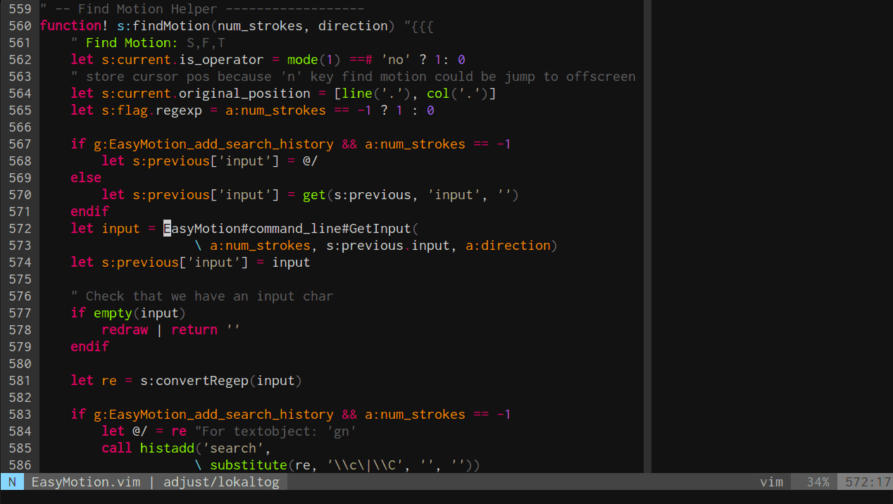

Vim 编辑器
=============

## 安装Vim
在Ubuntu下，默认集成了最小化版本的Vim (Vim minimal)，完整版本可以通过APT包管理器直接安装
```bash
$ sudo apititude install vim
```
安装完成后终端输入`vim`即可运行Vim，先别着急使用，输入`:q`退出，后面再细说Vim的使用。

因为Vim采用设计不是很优秀的VimScript作为扩展语言，限制了扩展的功能开发，所以目前更多的插件是通过第三方的编程语言实现的，例如Perl、Python、Lua等。要支持这些插件，必须在编译Vim时指定相应的选项，而软件仓库的二进制版本有可能并没有开启这些扩展接口。输入
```bash
$ vim --version
```
可以查看vim是否开启了相应的扩展，python和lua接口比较重要。例如自动补全插件 [Shougo/neocomplete.vim](https://github.com/Shougo/neocomplete.vim) 必须要lua接口开启。如果安装的Vim没有开启这些接口，建议直接编译源代码，在`./configure`时加上`--with-features=huge`选项，参考: [Building Vim](http://vim.wikia.com/wiki/Building_Vim)。

通常Ubuntu软件仓库安装的Vim能够符合大部分插件的要求。Vim同样具有GUI前端封装的版本，最常用的是`vim-gtk`和`vim-gnome`，可以从图形界面运行。

## 配置文件和插件
Vim的配置文件在用户的家目录`~`下面，`~/.vimrc`是配置文件，插件放在`~/.vim`文件夹中。网上有很多用户将自己的配置文件和插件方案集成了脚本，方便其它用户快速地配置Vim和安装常用的插件。推荐大牛 Steve Francia 的[spf13-vim](http://vim.spf13.com/)


只需要输入一行指令
```bash
$ curl https://j.mp/spf13-vim3 -L > spf13-vim.sh && sh spf13-vim.sh
```
等待较为漫长的插件安装过程，安装完成后，在终端输入`vim`，第一印象是界面变好看kkkjjj了。下面开始使用Vim!

## 热身
打开Ubuntu终端，输入`vim`启动Vim


看到左下角的_NORMAL_了吧，表示目前正在NORMAL模式下，在这个模式下是不能输入文本的，要进行编辑，需要切换到INSERT模式。输入`i`即可进入INSERT模式


这个时候便可以像普通的文本编辑器一样输入文字了，注意到左下角的模式指示符变成了`INSERT`。在这个模式下面，插入、删除文本都是非常直观的。使用`ESC`键可以返回到NORMAL模式。在NORMAL模式下面输入`:w test.txt`可以将当前的文本保存为当前目录的`test.txt`文件，也可以用其他路径替代。输入`:q`可以退出Vim，输入`:wq`可以保存并退出Vim，也可以使用`ZZ`(大写)保存并退出Vim。

如果要编辑一个已经存在的文件，如家目录下面的`.vimrc`，可以`vim ~/.vimrc`即可直接打开文件进行编辑。

截至目前，能使用Vim像普通编辑器一样工作了，注意到要输入指令，需要在NORMAL模式下完成，而添加文本通过INSERT模式完成。**流程**: 打开文件(NORMAL) -> 进入INSERT模式(`i`) -> 退出INSERT模式(`ESC`) -> 保存退出(`:wq`)。

指令都是语义的，例如`i`表示 insert，`:w`表示 write，`:q`表示 quit。以`:`开头的指令，输入时会显示在左下角，称为**底线(Last Line)指令**，不以`:`开头的指令在输入时会显示在右下角。

再引入几个NORMAL模式下的指令：
* `x`: 删除字符
* `dd`: 删除整行并压入剪切板
* `p`: 拷贝剪切板的内容
* h/j/k/l： ← ↓ ↑ → 移动
* `0`: 行首
* `$`: 行末
* `w/b`: 前进/后退一个单词

掌握了这些常用的指令并熟练使用，应该能够超过很大一部分Vim新手了。建议阅读完这一小节先跳过下一节，过几天后再看，这样曲线稍微平缓，也不容易半途而废。

## 进阶
在热身一段时间后，来进一步了解Vim的操作指令。热身阶段了解的指令，大部分是对应指令集合的子集。

首先看看Vim怎么查看帮助函数(文档)，这是学习任何东西最好的方式 - 阅读文档。`:help`后面加指令可以查看对应的文档，例如输入`:help w`


则会自动打开`w`的说明文档。

### INSERT模式切换
除了`i`之外，还有几个指令可以切换到INSERT模式，不同的是切换后光标所在的位置，一并总结如下:
* `i`: 在光标处插入
* `a`: 在光标之后插入
* `o`: 在下一行插入新行
* `O`: 在上一行插入新行
* `cw`: 删除光标所在位置到单词结尾的字符并放置光标

### 光标移动
光标移动的操作集合:
* `0`: 行首
* `$`: 行尾
* `^`: 当前行第一个不是空白字符的位置
* `g_`: 当前行最后一个不是空白字符的位置
* `gg`: 到首行
* `G`: 到末行
* `NG`: 到第N行
* `w`: 下一个单词的开头
* `e`: 下一个单词的结尾
记住上面的指令还是挺困难的，不过 spf13-vim 集成了[vim-easymotion](https://github.com/easymotion/vim-easymotion)插件，可以更方便地移动到任何地方



只需要输入`,,w`或`,,b`即可往前或往后移动，当然 vim-easymotion 还定义了许多移动的指令方式，相当于是Vim光标移动的一个超集，大家参考其网页各取所需吧。

### 剪切板
最常用的拷贝和粘贴:
* `yy`: 复制一行
* `p/P`: 粘贴在下一行/上一行

### 撤销操作
撤销/重做操作:
* `u`: 撤销
* `Ctrl+r`: 重做

### 文件读写
打开、存盘、退出等操作
* `:e`: 加上文件路径，打开文件
* `:w`: 存盘
* `:saveas`: 加上文件路径，另存为文件
* `wq`: 保存并退出

### 搜索
使用`/`加上字符串则可以对给定的字符串在文本中进行查找，使用`n`光标跳到下一个匹配处，`N`光标跳到上一个匹配处。另外比较方便的查找指令包括：
* `#`: 匹配当前光标所在的单词，并跳到当前光标后第一处匹配
* `*`: 匹配当前光标所在的单词，并跳到当前光标前第一处匹配

熟练掌握上面的指令，在文本编辑上完爆大多数人，应该不是很大的问题，下面进一步拓展语义指令的定义。

## 重复操作
在指令里加入数字，可以方便地执行指定次数的指令，例如：
* `3yy`: 复制3行
* `5p`: 粘贴5次
* `10dd`: 删除10行
* `10w`: 前进10个单词

另外还可以输入`.`来重复最近的一次操作，`5.`则表示重复5次最近的操作。

## 区域操作: in 和 all
Vim可以方便地对某个区域内的字符串进行操作，格式是：`操作`+`i/a`+`字符`，操作支持`d`,`y`,`v`等，`i`表示in，即在字符内的片段，`a`表示all，即包括给定字符的片段。这一部分较难阐述，还是举个栗子比较容易明白，例如给了一个字符串:`var dict = {'name':'小茗', 'age':'23'}`，输入：
* `vi{`: 可视化选择{包围的部分，即'name':'小茗', 'age':'23'
* `va{`: 可视化选择包括{}的部分，即{'name':'小茗', 'age':'23'}
* `di'`: 删除name
* `da'`: 删除'name'

## 多行编辑
使用`Ctrl+V`，然后`j/k`上下选择多行，然后`I/A`进行插入，再`ESC`，即可完成对选定行的相同操作，示例(credits：陈皓)


## 宏操作
宏操作可以把重复性的工作封装进一个宏，这样可以减少重复进行某一个操作的工作量。使用`qa`开始将宏录制到寄存器`a`中，然后开始一系列的操作，完成后`q`退出宏录制，使用`@a`调用宏，使用`100@a`就可以调用100次宏。示例，把删除一行的最后一个字符的操作录制成宏: `qa$xq`，使用`@a`就可以把当前行的最后一个字符删除，除了`a`之外，还支持使用其它寄存器。

## 指南
看过上面的内容估计头已经晕了，现在把它们都忘掉，打开vim，输入`:Tutor`阅读一遍Vim的自带指南，过程中注意理解指令的设计思想，读完之后，应该就能像张无忌一样上场了;-)

## 插件功能
除了Vim本身提供的语义序列操作思想外，丰富的插件大大优化了文本编辑体验，下面附上常用的插件及其出处，插件都有自己详细的文档作为使用说明，按需选择即可。下面的插件都是默认通过spf13-vim配置好的。

### 通用编程

|Plugin|For What?|
|:-----|:--------|
|[Shougo/neocomplete.vim](https://github.com/Shougo/neocomplete.vim)|Auto completion|
|[Raimondi/delimitMate](https://github.com/Raimondi/delimitMate)|Auto-completion for quotes, parens, brackets, etc.|
|[scrooloose/syntastic](https://github.com/scrooloose/syntastic)|Syntax checking|
|[scrooloose/nerdcommenter](https://github.com/scrooloose/nerdcommenter)|Intensely orgasmic commenting|
|[godlygeek/tabular](https://github.com/godlygeek/tabular)|Text filtering and alignment|
|[easymotion/vim-easymotion](https://github.com/easymotion/vim-easymotion)|Motion on speed|
|[Shougo/deoplete.nvim](https://github.com/Shougo/deoplete.nvim)|Auto Completion|

### 视觉增强

|Plugin|For What?|
|:-----|:--|
|[scrooloose/nerdtree](https://github.com/scrooloose/nerdtree)|Tree explorer|
|[flazz/vim-colorschemes](https://github.com/flazz/vim-colorschemes)|Colorscheme pack|
|[bling/vim-airline](https://github.com/bling/vim-airline)|Status/tabline|
|[nathanaelkane/vim-indent-guides](https://github.com/nathanaelkane/vim-indent-guides)|Visually displaying indent levels|
|[bronson/vim-trailing-whitespace](https://github.com/bronson/vim-trailing-whitespace)|Highlights trailing whitespace in red and provides :FixWhitespace to fix it.|
|[kien/rainbow_parentheses.vim](https://github.com/kien/rainbow_parentheses.vim)|Better Rainbow Parentheses|

### 版本控制

|Plugin|For What?|
|:-----|:--|
|[mhinz/vim-signify](https://github.com/mhinz/vim-signify)|Show a diff via Vim sign column|

### python增强

|Plugin|For What?|
|:-----|:--|
|[klen/python-mode](https://github.com/klen/python-mode)|"The plugin contains all you need to develop python applications in Vim."|

### Web开发

|Plugin|For What?|
|:-----|:--|
|[HTML-AutoCloseTag](https://github.com/vim-scripts/HTML-AutoCloseTag)|Automatically closes HTML tags once you finish typing.|
|[gorodinskiy/vim-coloresque](https://github.com/gorodinskiy/vim-coloresque)|Visualizing web colors|
|[hail2u/vim-css3-syntax](https://github.com/hail2u/vim-css3-syntax)|CSS3 syntax support|

### 书写环境

|Plugin|For What?|
|:-----|:--------|
|[plasticboy/vim-markdown](https://github.com/plasticboy/vim-markdown)|Markdown syntax highlighting, matching rules and mappings|
|[junegunn/goyo.vim](https://github.com/junegunn/goyo.vim)|Distraction-free writing|
|[junegunn/limelight.vim](https://github.com/junegunn/limelight.vim)|Hyperfocus-writing|
