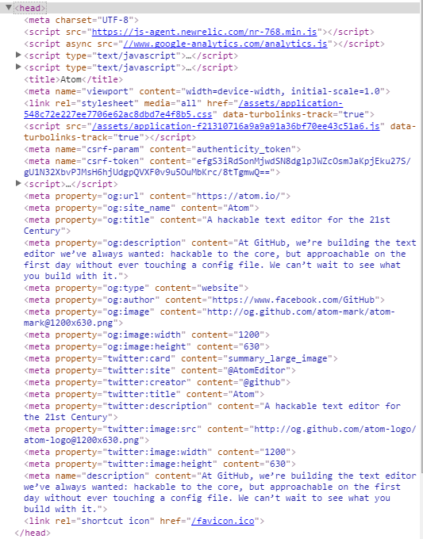
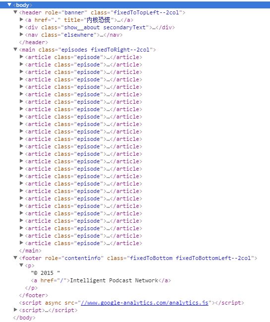
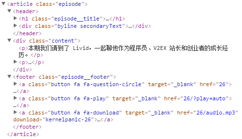

html简介
=======

## 什么是html
**超文本标记语言(Hyper Text Markup Language)**，主要构成是各种**标记标签(markup tags)** 和网页的**内容**，用来描述网页呈现的内容。html标签由尖括号包围，通常成对出现(开始标签+结束标签)，少数情况不成对出现。

Web浏览器读取html文件，渲染并呈现(内容)给用户，标记标签的作用就是控制内容格式。因此可以这么说：html=内容+格式。由此也可以见到html没有出现常见的编程语言的流程控制等特性，故通常被认为**不**属于编程语言，而纯粹的是一种标记语言。

## 常用标签
本小节记录最常用到的标签，并解释其作用。

|标签名字|作用|
|:------|:---|
|`<html></html>`|标签之间的文本表示网页|
|`<head></head>`|定义文档的头部|
|`<body></body>`|可见的页面内容|
|`<style></style>`|CSS内容|
|`<script></script>`|javascript内容|
|`<div></div>`|分节/块|
|`<h{num}]></h{num}>`|标题，num表示标题级别:1-6|
|`<p></p>`|文本段落|
|`<a></a>`|超链接|
|``|图片|
|`<table></table>`|表格|
|`<li></li>`|列表项目|
|`<br />`|换行|

这里记录的这些标签是最常用，也能第一时间在脑中想到的标签。至于一个完备的标签集合应该包含哪些元素，这个其实是和文档的格式要求有关系的。所以没有必要记住所有的标签名字，而是在编写html时需要特定格式时再查询文档看看需要使用哪一个标签，是更可行和高效的方法，这一点我们之后在说Bootstrap时会显得特别重要。

## 常用属性
本小节记录最常用到的标签的属性，并解释其作用。属性通常用于补充标签的描述能力。

### 专有属性
一些标签具有的属性

|属性|作用|
|:------|:---|
|`href`|`<a></a>`标签的超链接地址|
|`width`,`height`|标签的尺寸|

### 标准属性
大多数标签支持的属性，这一类属性是最常用的，CSS依靠`class`和`id`来确定需要定义样式的目标，`style`则可以直接用于书写行内样式(inline style)。

|属性|作用|
|:------|:---|
|`class`|规定标签元素的类名|
|`id`|规定标签元素唯一的id号|
|`style`|规定标签元素的样式|

参考: [HTML标准属性](http://www.w3cschool.cn/html_ref_standardattributes.html)

### 事件属性
用于触发事件的属性，网页的一大特点是需要处理大量的事件(主要是用户行为)，与之前说得html不涉及流程控制这一说法不冲突，事件属性的值是javascript定义的表达式和函数。

这一部分完整的属性参考: [HTML事件属性](http://www.w3cschool.cn/html_ref_eventattributes.html)

## HTML实例分析
上面的内容或许有些枯燥，下面我们到实际存在的网页上去分析代码！

### 1. `<head></head>`实例分析
Atom编辑器网站:[Atom.io](https://atom.io/)



* `<meta>`为元标签，`charset="UTF-8"`设置文档编码，参考:[HTML <meta> charset Attribute](http://www.w3schools.com/tags/att_meta_charset.asp)。。`name="description" content=""`设置对网站的描述。`<meta property="og:..">`为open graph设置，同理"twitter:"为twitter的相关设置。
* `<script></script>`运行的javascript脚本,`async`表示异步运行，参考:[async Attribute](http://www.w3schools.com/tags/att_script_async.asp)
* `<title></title>`:设置网页标题
* `<meta name="viewport" content="width=device-width, initial-scale=1.0">`:响应式布局，参考:[Responsive Web Design - The Viewport](http://www.w3schools.com/css/css_rwd_viewport.asp)
* `<link rel="stylesheet" media="all" href="">`:`<link>`用于加载外部资源，rel用于定义html文档与外部文档的关系，`rel="stylesheet"`时表示链接CSS文件，`media="all"`表示对所有设备都加载CSS文件，`href=""`指定CSS文件的位置。
* `<script></script>`:放置web浏览器加载html代码时需要执行的javascript代码，也可以用`src=""`来指定外部的`*.js`文件。注意某些`<script></script>`段并不在`<head></head>`中，而是放在html尾部，这决定了何时运行这些javascript代码

接下来对于我们最重要的是`<link rel="stylesheet">`、`<script></script>`两个标签，因为他们分别设置了外部CSS文件和JS文件，这也是html、CSS、Javascript三者合而为一的地方。

### 2. `<body></body>`实例分析
内核恐慌Podcast节目网站:[https://ipn.li/kernelpanic/](https://ipn.li/kernelpanic/)



可以看到首先有`<header></header>`标签，主要用于页面的标题和导航菜单部分，对应于网站左侧的简介和分享链接等。

然后是`<main></main>`，就像字面上一样，表示页面的主要内容就在这一块了，里面有很多个嵌套的`<article></article>`，对应每一期节目，其`class`属性为`episode`，这是网站作者在CSS文件里自定义的类，用于样式化一期节目的展示格式。展开`<article>`,详细看看其代码



可看到里面又嵌套了一个`<header></header>`，里面包括`<h1></h1>`和`<div></div>`，分别用于显示每一期的标题和录制主播的名字和日期，然后`<div class="content"></div>`用于显示本期节目的简介内容，然后是`<footer></footer>`用于放置三个按钮。

`<footer></footer>`是页面底部的内容，一般用来写copyright内容。然后注意到还有两个`<script></script>`标签，用来设置google-analytics，放在这里是希望首先把页面内容呈现给用户，而不是先加载google-analytics。

### 3. `<script></script>`实例分析
数据驱动文档示例:[Rainbow Circle](http://bl.ocks.org/mbostock/45943c4af772e38b4f4e)

```html
<script src="https://cdnjs.cloudflare.com/ajax/libs/d3/3.5.5/d3.min.js"></script>
<script>
var π = Math.PI,
    τ = 2 * π,
    n = 500;
var width = 960,
    height = 960,
    outerRadius = width / 2 - 20,
    innerRadius = outerRadius - 80;
d3.select("svg").append("g")
    .attr("transform", "translate(" + width / 2 + "," + height / 2 + ")")
  .selectAll("path")
    .data(d3.range(0, τ, τ / n))
  .enter().append("path")
    .attr("d", d3.svg.arc()
        .outerRadius(outerRadius)
        .innerRadius(innerRadius)
        .startAngle(function(d) { return d; })
        .endAngle(function(d) { return d + τ / n * 1.1; }))
    .style("fill", function(d) { return d3.hsl(d * 360 / τ, 1, .5); });
d3.select(self.frameElement).style("height", height + "px");
</script>
```
首先通过设置外部`js`文件加载d3.js库，接下来的`<script></script>`里面直接放置的是javascript代码。

## Homework
1. 有时候html文档的后缀是`.html`，有时候却是`.htm`，他们有区别吗？为什么会存在两种不同的后缀名？
2. 访问[Bootstrap组件](http://v3.bootcss.com/components/#progress)，看看实例代码里的都是用的什么标签？
3. 访问[Bootstrap组件](http://v3.bootcss.com/components/#progress)，看看实例代码里都用了什么属性？
