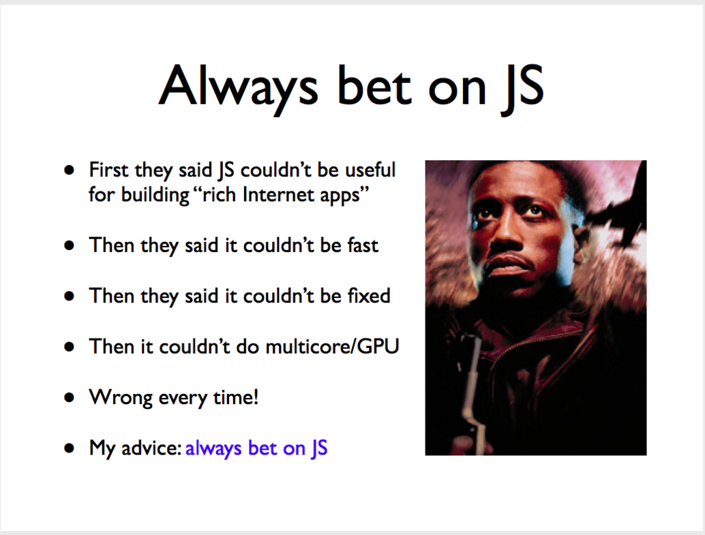
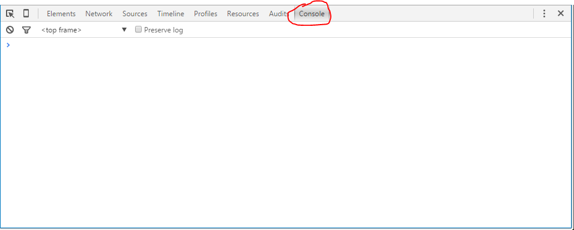

Javascript基础
==============

## 逆袭历史
1995年，网景公司正凭借其Navigator浏览器成为Web时代开启时最著名的第一代互联网公司。由于网景公司希望能在静态HTML页面上添加一些动态效果，于是叫Brendan Eich在两周之内(10天＝＝!)设计出了JavaScript语言。JavaScript之所以是JavaScript，原因是当时Java语言太火了，网景公司希望借Java的名气来推广(抱大腿。。。)，但事实上JavaScript除了语法上有点像Java(因为都是C风格，当然像==!)，其他部分基本上没啥关系。

可见JavaScript的出身是多么悲惨，业界起初都视其为“玩具语言”。但是随后的20年，互联网的白热化发展帮助JavaScript完成了逆袭，正因为其一开始被认为存在性并不重要，导致了大家都意识到需要有这样的语言时，只有JavaScript能够挑大梁(**钦定**)。

为什么JavaScript会逆袭，总结几点原因：
* Web技术发展，应用Web化，更多人了解到JavaScript
* 需要有语言用数据来驱动网页，而不是设计人员把网站的内容写出来
* 重要的事说三遍：交互！交互！交互！

Brendan Eich在2015年5月份做了一个slide来回顾js这20年的发展，介绍ES6标准，展望ES7标准，参考[JavaScript at 20](https://brendaneich.github.io/ModernWeb.tw-2015/#74)

由于10天就被写出来了，JavaScript存在设计缺陷，为了改进语言设计，实现标准化和衍进，ECMA（European Computer Manufacturers Association）组织定制了JavaScript语言的标准，被称为ECMAScript标准(换了个名字一是为了不那么土，而是因为网景注册了JavaScript的商标)，所以当谈到ECMAScript时，我们实际上在谈JavaScript。最新版ECMAScript 6标准（简称ES6）在2015年6月正式发布，参考[ECMAScript 2015 Language Specification
](http://www.ecma-international.org/ecma-262/6.0/)，所以当谈到ECMAScript 2015时，我们实际上在谈ES6。

因为受到了宠爱，JavaScript持续得到改进，所以作者Brendan Eich才会霸气地说



本节现从最简单的语法入手，更深入的javascript会单独开一次课来讲解。

## 开发工具
因为是运行在Web浏览器中(Node.js可以在本地或服务器端运行)，所以浏览器是最好的运行JavaScript代码的工具。运行Chrome浏览器，点击F12或者Ctrl+Shift+I，会打开Chrome的开发者工具，点击Console选项卡，则可以输入javascript代码并运行。



例如输入
```javascript
alert('Hello, world');
```
浏览器会弹框输出“Hello, world”。

实际上浏览器加载html文档时会运行`<script></script>`中间的javascript代码。

## 基本语法
JavaScript的基本语法和C风格的语言非常相似，语句用`;`结束，代码块用`{...}`包围，`if`语句的条件判断也在括号中。不同的是javascript是**动态语言**，不需要显式声明变量的类型，但需要注意的是需要用关键字`var`来表示变量(当然也可以不用，会造成复杂的情况, ECMA用`use strict`修复)，如
```javascript
var x = 1;
```
变量名用英文、数字、`$`和`_`组成，不能用数字开头，且不能是关键字。


和C或者Java一样，缩进可以提高代码的可读性，当然代码也可以完全放在一行，比如一些标明“用于生产环境”的js文件(通常是*.min.js)，都是放在一行的，这样可以减小浏览器加载js文件时的消耗(CSS文件也可以这么干)。

同样的，有单行注释`//...`和多行注释`/*...*/`两种注释语法。

javascript对大小写敏感。

### 数据类型

|数据类型|示例|运算|
|:------|:--|:----|
|数值|123,0.456,1.2345e3,-99,NaN,Infinity,0xffff|`+,-,*,/,%`,`>,<,<=,>=,===`|
|字符串|"Hello",'World','\x41','\u4e2d\u6587'|str.length,str.toUpperCase(),str.toLowerCase(),str.indexOf(),str.substring()|
|布尔|true,false|同C语言|
|空|null||
|数组|[1,2.78,'word',null]|下标[0,1,2...],arr.length,arr.indexOf(),arr.slice(),arr.push(),arr.pop(),arr.sort(),arr.reverse(),arr.concat(),arr.join()|
|对象|var room={num:530,tag:'lab'}|`room.num`,`in`,`hasOwnProperty()`|

### 循环控制
和C语言的`for()`语句一样
```javascript
var arr = ['Apple', 'Google', 'Microsoft'];
var i, x;
for (i=0; i<arr.length; i++) {
    x = arr[i];
    alert(x);
}
```
以及在某些时候更好用的`for...in`，得到的是索引
```javascript
var a = ['A', 'B', 'C'];
for (var i in a) {
    alert(i); // '0', '1', '2'
    alert(a[i]); // 'A', 'B', 'C'
}
```
和`for...of`，得到的是值
```javascript
var a = ['A', 'B', 'C'];
a.name = 'Hello';
for (var x of a) {
    alert(x); 'A', 'B', 'C'
}
```
以及`while()`语句
```javascript
var x = 0;
var n = 99;
while (n > 0) {
    x = x + n;
    n = n - 2;
}
x; // 2500
```

## 函数
函数定义示例
```javascript
function abs(x) {
    if (x >= 0) {
        return x;
    } else {
        return -x;
    }
}
```
`function`表示这是一个函数，至于为什么要显式说明函数，涉及到**函数式编程思想**，简单地说，就是函数也可以作为返回值。`abs`是函数名，`(x)`是参数，`return`表示返回语句。

因为函数也可以作为变量返回，也可以赋值给一个变量，故下面方式亦可
```javascript
var abs = function (x) {
    if (x >= 0) {
        return x;
    } else {
        return -x;
    }
};
```

函数式编程这一块是javascript的精髓，具体细节我们下次单独讲javascript的时候再分析。

## 浏览器DOM
html文档在浏览器中以DOM(Document Object Model)-文档对象模型表示为**树**结构。要用javascript驱动html文档，首先了解浏览器DOM的结构。

### `window`对象
表示浏览器窗口，具有`innerWidth`和`innerHeight`属性，分别表示网页的宽度和高度，示例
```javascript
alert('window inner size: ' + window.innerWidth + ' x ' + window.innerHeight);
```

### `navigator`对象
表示浏览器信息
* navigator.appName：浏览器名称或Netscape；
* navigator.appVersion：浏览器/操作系统版本；
* navigator.language：浏览器设置的语言；
* navigator.platform：操作系统类型；
* navigator.userAgent：浏览器设定的User-Agent字符串。

```javascript
alert('appName = ' + navigator.appName + '\n' +
      'appVersion = ' + navigator.appVersion + '\n' +
      'language = ' + navigator.language + '\n' +
      'platform = ' + navigator.platform + '\n' +
      'userAgent = ' + navigator.userAgent);
```

### `screen`对象
表示设备显示器信息
screen.width：屏幕宽度，以像素为单位；
screen.height：屏幕高度，以像素为单位；
screen.colorDepth：返回颜色位数，如8、16、24。

```javascript
alert('Screen size = ' + screen.width + ' x ' + screen.height);
```

### `location`对象
当前页面的url信息，例如一个url地址为
```
http://www.example.com:8080/path/index.html?a=1&b=2#TOP
```

可以用`location.href`获取。此外还包括其它属性，分别表示url信息的一部分
```javascript
location.protocol; // 'http'
location.host; // 'www.example.com'
location.port; // '8080'
location.pathname; // '/path/index.html'
location.search; // '?a=1&b=2'
location.hash; // 'TOP'
```

### `document`对象(最重要)
表示当前页面，是DOM树的根节点，可以通过html元素的标签和id来查找DOM节点。示例，html文档一部分如下,`<dl>`表示description list，`<dt>`表示terms，`<dd>`表示description或者definition。
```html
<dl id="drink-menu" style="border:solid 1px #ccc;padding:6px;">
    <dt>摩卡</dt>
    <dd>热摩卡咖啡</dd>
    <dt>酸奶</dt>
    <dd>北京老酸奶</dd>
    <dt>果汁</dt>
    <dd>鲜榨苹果汁</dd>
</dl>
```

```javascript
// 获得id为drink-menu的元素
var menu = document.getElementById('drink-menu');
alert(menu.tagName); //DL
// 获得所有dt标签元素
var drinks = document.getElementsByTagName('dt');
var i, s;

s = '提供的饮料有:';
for (i=0; i<drinks.length; i++) {
    s = s + drinks[i].innerHTML + ',';
}
alert(s);
```

记住`document.getElementById()`和`document.getElementsByTagName()`实际上进行的是在DOM树上进行查找的过程,此外还有`document.getElementsByClassName()`。

### 更新DOM
获得了DOM节点(html元素)后，可以对其进行修改(驱动html的一种方式，还有增加和删除DOM节点)。`innerHTML`属性返回DOM节点内的文本，这样可以修改元素显示的内容。若要修改元素的样式，可以通过`style`属性来修改。
### 插入DOM
`appendChild()`可以把一个子节点添加到父节点的最后一个子节点，示例:
```html
<!-- HTML结构 -->
<p id="js">JavaScript</p>
<div id="list">
    <p id="java">Java</p>
    <p id="python">Python</p>
    <p id="scheme">Scheme</p>
</div>
```
```javascript
var
    js = document.getElementById('js'),
    list = document.getElementById('list');
list.appendChild(js);
```
更常见的是动态创建DOM节点后添加到DOM树中，示例
```javascript
var d = document.createElement('style');
d.setAttribute('type', 'text/css');
d.innerHTML = 'p { color: red }';
document.getElementsByTagName('head')[0].appendChild(d);
```
此外还可以通过`parentElement.insertBefore(newElement,referenceElement);`将`newElement`节点添加到`referenceElement`前面，两者都是`parentElement`的子节点。参考[insertBefore()方法](http://www.w3school.com.cn/jsref/met_node_insertbefore.asp)

### 删除DOM
使用`removeChild()`方法删除子节点，示例
```javascript
// 拿到待删除节点:
var self = document.getElementById('to-be-removed');
// 拿到父节点:
var parent = self.parentElement;
// 删除:
var removed = parent.removeChild(self);
```

以上介绍的只是最简单的操作浏览器DOM的方法，除此之外，还有提交用户表单等需要向服务器请求并且需要响应的操作，需要用到ajax(Asynchronous JavaScript and XML)执行**异步网络请求**，我们会在单独的javascript课中进一步讲解。还有更有趣的是，html5标准提出后，canvas特性可以脱离Flash在网页上绘制媒体对象，这一点我们会在之后的数据可视化一节中详细讲。

## jQuery
jQuery是广泛使用的javascript库，稍后使用Bootstrap时会注意到也依赖于jQuery。jQuery主要作用有:
* 清除跨浏览器平台差异
* 简化DOM操作
* 写动画

jQuery把所有的功能封装到变量`jQuery`中，即`window.jQuery`，更常用的用法是其别名`window.$`，我们阅读代码时经常会遇到`$`后加一个括号，括号内为id或class，比如`$('#test')`和`document.getElementById('test')`是等效的，实际上`$`是一个函数。

jQuery的理念是**Write Less, Do More.** ,利用其**选择器**可以更方便地操作DOM树；利用其事件响应，可以方便地给按钮等控件添加响应函数；利用其动画样式，可以更方便的创建动画效果；利用其写ajax，可以忽略浏览器平台的差异。

## Node.js
JavaScript一开始只是钦定的前端语言，直到Google为了优化javascript性能开发出了V8引擎。Ryan Dahl的工作是用C/C++写高性能Web服务，后来开始想用更高级特性的编程语言来简化工作，但是又不想再创造一门新的编程语言，于是机智地瞄准了Javascript，原因是JavaScript只能单线程运行，只支持异步IO，并且可以捡Google的便宜，直接把V8修改一下就可以了。2009年，Ryan推出了"运行在服务端"的Node.js。之后，Node.js发展得顺风顺水，甚至一些桌面端的程序框架也基于Node.js，比如Github团队推出的Atom编辑器。

目前我们使用的Web服务器是Python的SimpleHTTPServer模块提供的，后面我们将会逐步过渡到Node.js上面。

## 下一次我们谈到JavaScript之前可以阅读的资料
1. [阮一峰-ECMAScript 6 入门](http://es6.ruanyifeng.com/)
1. [廖雪峰－JavaScript教程](http://www.liaoxuefeng.com/wiki/001434446689867b27157e896e74d51a89c25cc8b43bdb3000)
2. [快速搭建node.js](http://fengmk2.com/blog/2014/03/node-env-and-faster-npm.html)
3. [7天学会node.js](http://nqdeng.github.io/7-days-nodejs/)
3. [node.js入门](http://www.nodebeginner.org/index-zh-cn.html)

其中1-2详细地介绍了javascript的细节，3-5是关于node.js的，在下次讲javascript前阅读这些教程是必要的，否则一些概念在课上会很难说清楚。
