虚拟机安装Linux发行版
=========

和多数人推荐使用双系统安装Linux不同，我推荐使用虚拟机安装和使用Linux，原因如下:
* 目前计算资源过剩，虚拟机能满足普通应用场合性能要求
* 在使用Linux的同时能够使用Windows下的优秀软件(Office等)
* 安装双系统对新手来说维护成本太大
* 虚拟机管理和备份系统非常方便

目前流行的虚拟机有[VMware](http://www.vmware.com/cn)和[VirtualBox](https://www.virtualbox.org/wiki/Downloads)，Mac平台下最流行的是[Parallel Desktop](http://www.parallels.com/cn/products/desktop/)。本节采用免费小巧且功能完备的VirtualBox在Windows下安装Linux发行版。

## VirtualBox安装、配置
首先[下载VirtualBox安装包](http://download.virtualbox.org/virtualbox/5.0.8/VirtualBox-5.0.8-103449-Win.exe)，双击运行安装，完成后启动VirtualBox

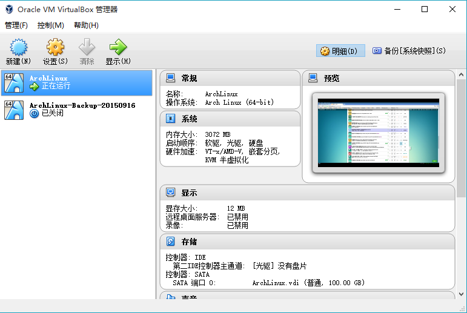

`Ctrl+G`打开全局设定，将`默认虚拟电脑位置`修改到空闲空间较多的分区下的文件夹内

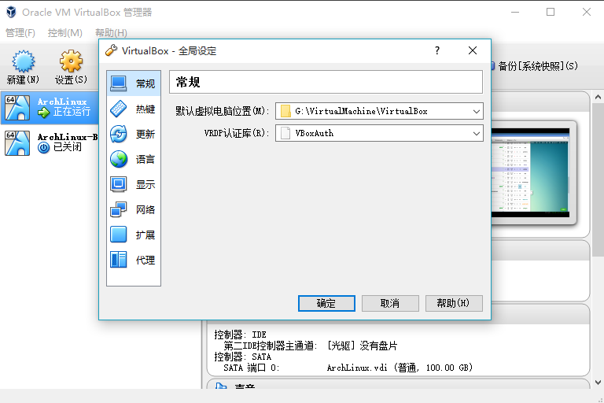

**2015-10-26 Troubleshooting**:对于不能安装或正常使用VirtualBox的原因，总结如下:
1. 不能新建虚拟机或新建了无法运行:破解了windows系统主题导致系统的uxtheme.dll文件被修改。这个bug首先要怪Microsoft，设计了一套复杂而又糟糕的主题定制系统；其次要怪Oracle，没有考虑到这个问题。与其麻烦地恢复这个文件，建议换用vmware作为虚拟机。
> 参考:
> * [Ticket #13504:Unable to load R3 module](https://www.virtualbox.org/ticket/13504?cversion=1&cnum_hist=1)

2. 只能创建32位虚拟系统且性能极差: 没有开启虚拟化技术或者被Hyper-V独占，解决方法:在BIOS里面开启CPU的虚拟化技术支持，然后禁用windows的Hyper-V功能。原因和解决方法见如下参考
> 参考:
> * [64 bit computer & virtualbox but only gives me 32bit options](https://forums.virtualbox.org/viewtopic.php?f=3&t=60411) 中二楼Perryg的回答
> * [Enabling Intel VT and AMD-V virtualization hardware extensions in BIOS](https://access.redhat.com/documentation/en-US/Red_Hat_Enterprise_Linux/5/html/Virtualization/sect-Virtualization-Troubleshooting-Enabling_Intel_VT_and_AMD_V_virtualization_hardware_extensions_in_BIOS.html)
> * [Run virtual machines on Windows 8.1 with Client Hyper‑V](http://windows.microsoft.com/en-us/windows-8/hyper-v-run-virtual-machines) 关闭Hyper-V功能做相反的操作

## 安装Ubuntu 14.04
14.04版本属于LTS(Long Term Support)版本，具有相对稳定且版本较新的软件仓库，适合日常开发使用。

首先，[下载Ubuntu 14.04安装镜像](ftp://ftp.sjtu.edu.cn/ubuntu-cd/14.04.3/ubuntu-14.04.3-desktop-amd64.iso)。

打开VirtualBox, `Ctrl+N`新建虚拟机，点击`专家模式`


在`名称`一栏输入ubuntu,会自动设置为64位版本的Ubuntu,内存大小默认选择768MB，如果机器内存充足，可以选择更大的内存，然后点击`创建`

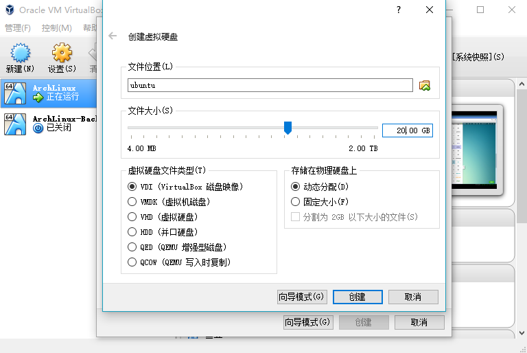

设置虚拟磁盘的大小为20GB，点击`创建`完成新虚拟机的创建。

选择ubuntu后，点击`设置`，进入`网络`选项卡，将连接方式选择为“桥接网卡”，然后点击`确定`完成设置。这样虚拟机将会分配独立的ip地址，方便后续的使用

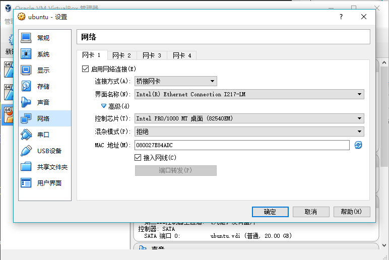

在VirtualBox的主面板选择双击ubuntu或选定ubuntu后点击启动


在弹出的对话框中点击文件夹图标，打开镜像选择对话框

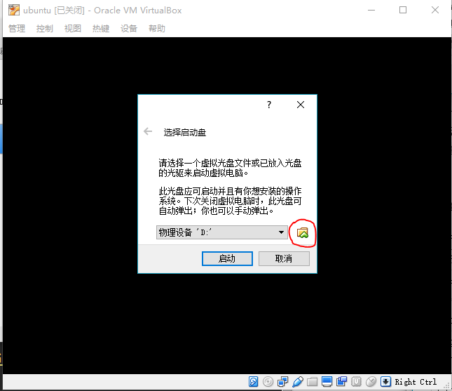

选择之前下载的Ubuntu安装镜像，点击`打开`，然后单击`启动`，启动安装界面

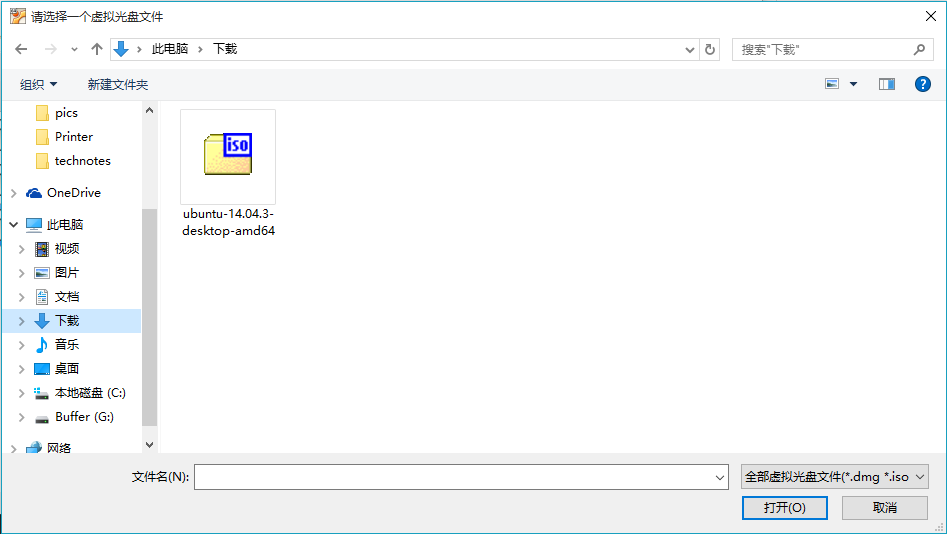

然后会出现安装界面，左侧边栏可以选择系统语言，推荐入门者使用简体中文，然后点击`安装Ubuntu`


点击`继续`


点击`默认设置`

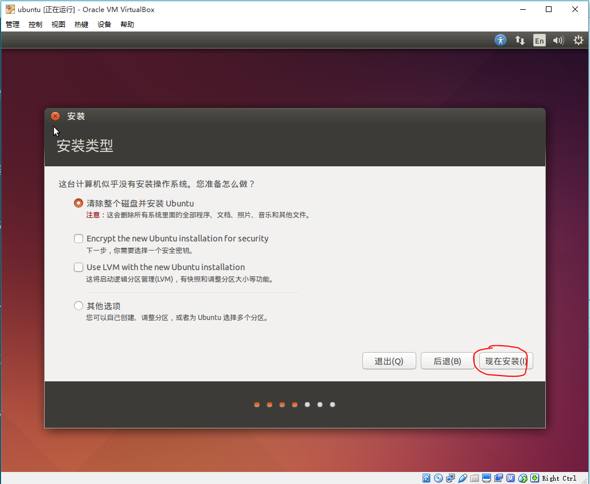

点击`继续`

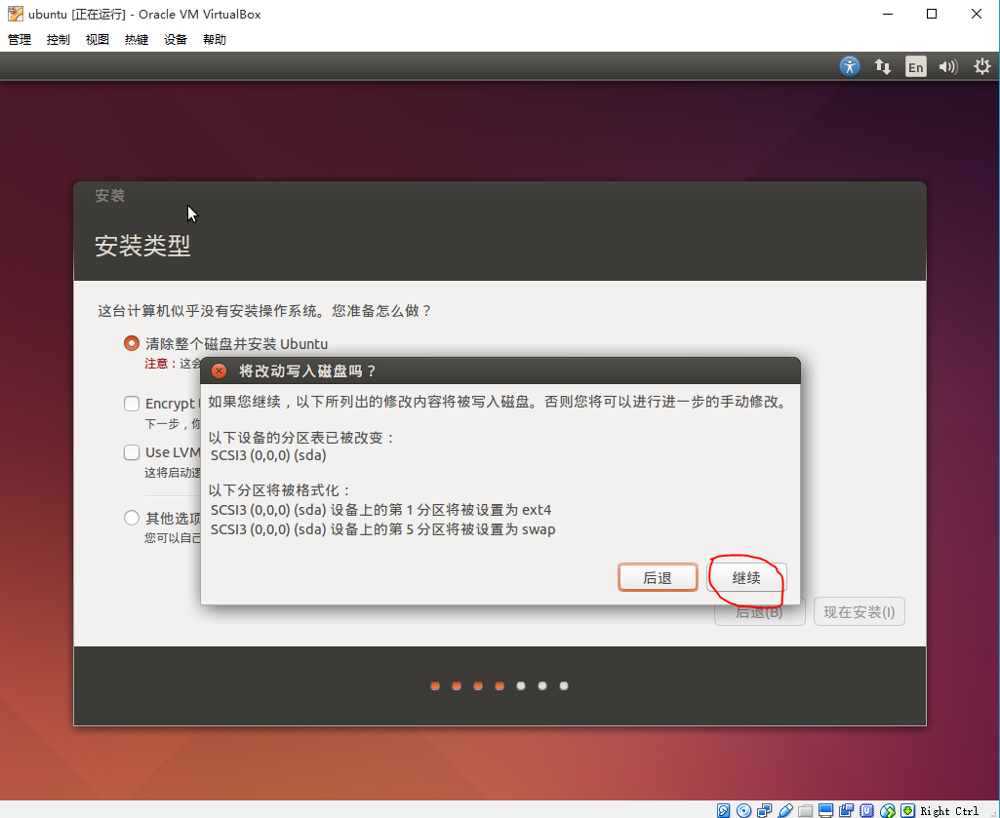

点击`继续`

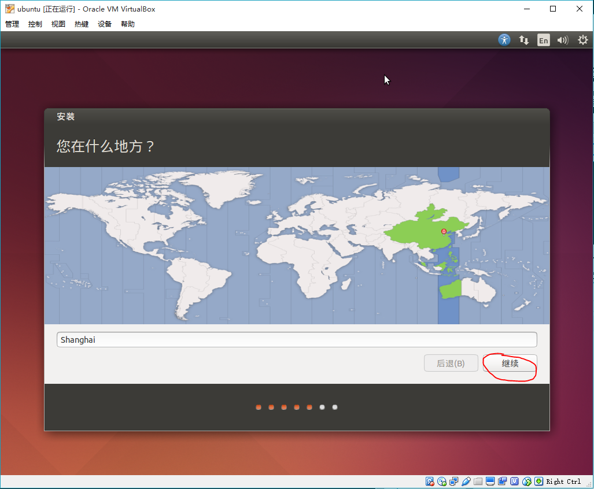

点击`继续`

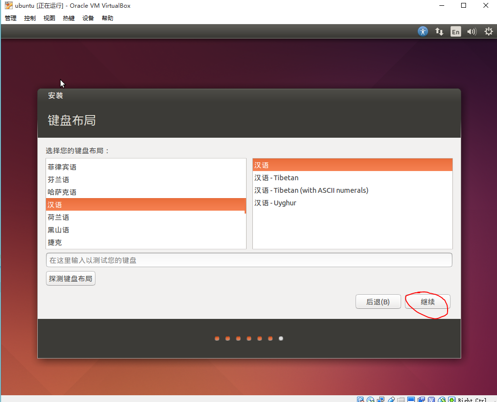

设置用户名和密码

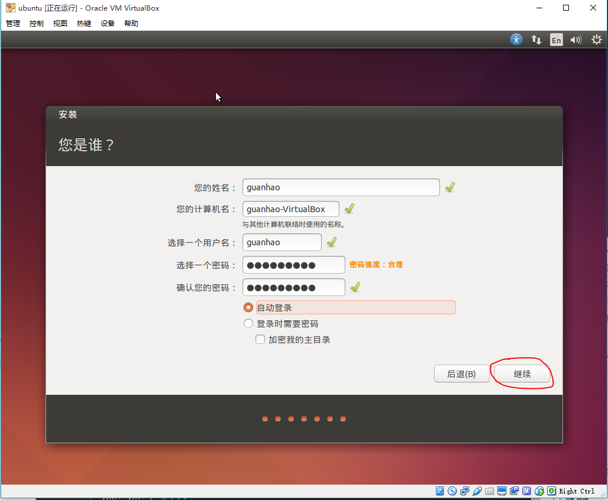

等待安装完成

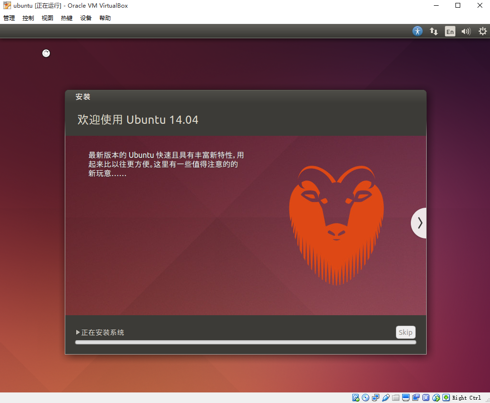

安装完成出现以下界面

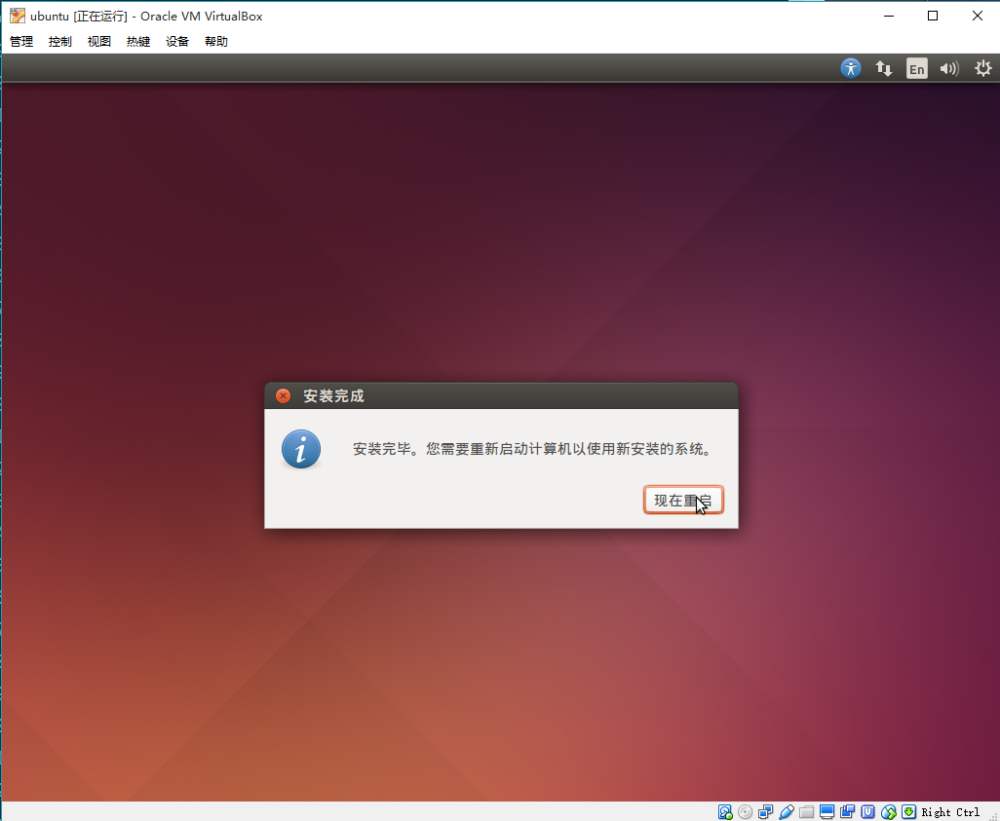

在重启进入新系统之前，卸载安装镜像:设备->分配光驱->取消选择ubuntu安装镜像

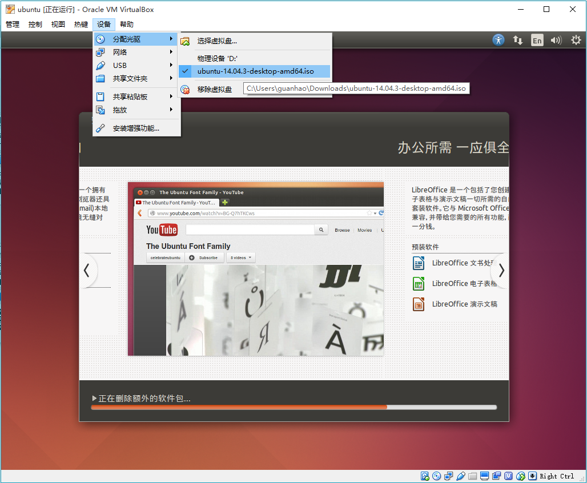

然后点击`重新启动`,安装完毕！

## ubuntu软件仓库镜像设置
Ubuntu的软件仓库因为是开源的，所以各大开源镜像站均有其软件仓库的镜像。使用不同的镜像，速度差异甚大，在国内推荐使用中科大或者交大的镜像。设置方法如下：进入系统后，会提示有软件更新，暂时不更新，点击`设置`按钮。


在弹出的对话框中选择`ubuntu软件`选项卡，选择`其他站点...`

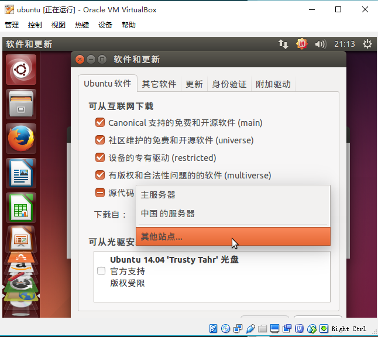

系统会按照镜像站的速度排序，因为是校内环境，交大的ftp开源镜像站排在首位，选择他!


输入自己的账户密码，点击授权


**注意**:在涉及到修改系统全局设置等风险操作时，需要强制输入密码进行授权，这是一种安全机制。

然后点击窗口左上角的关闭按钮，这时会提示刷新软件仓库的缓存，点击`重新载入`


等待软件仓库缓存刷新完毕


## 打开命令行!
点击`Ctrl+Alt+t`，启动`终端`,会弹出一个类似于Windows的CMD的命令行界面，这是 ubuntu的终端模拟器，能够执行bash指令

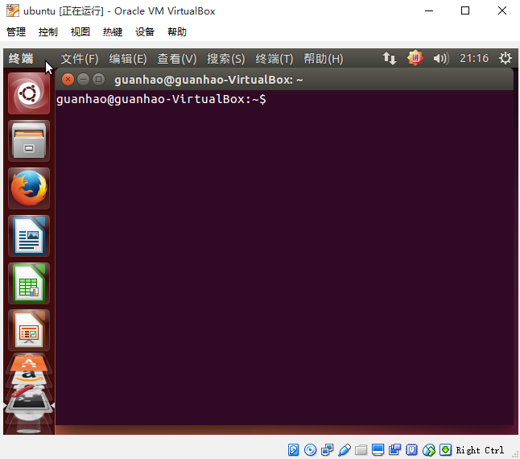

现在输入第一条命令！输入`sudo apt-get install build-essential`安装基本的开发套件


首先会提示输入密码(因为安装软件是一个修改全局系统的指令，需要授权)，注意输入密码的时候不会有\*提示符，这也是一种安全机制，输入完毕后点击回车键，则会提示需要安装的软件包以及系统空间的改变等情况，输入Y并回车，开始安装(下载的过程会非常迅速)。

之后的大多数操作，都是在命令行里面完成，这种情况之后不再截图，当看到类似于
```bash
$ commands
```
时表示在终端中输入`commands`命令，`$`是命令行提示符，表示用普通用户执行。

## 安装VirtualBox增强功能
点击设备->安装增强功能

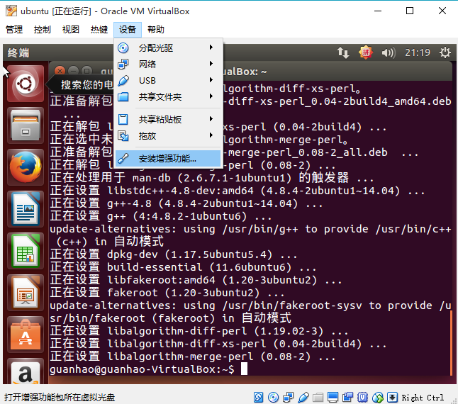

打开终端，依次输入(将`用户名`替换为自己的用户名):
```bash
$ cd /media/[用户名]/VBOXADDITIONS_5.0.6_103037/ # 进入存放VBox增强功能的目录
$ ls # 查看当前目录的文件
$ sudo ./VBoxLinuxAdditions.run # 用超级权限执行安装程序
```
注意第一行`cd`是unix类系统切换目录的指令，第二行`ls`可以查看当前目录的文件，第三行`sudo`可以允许普通用户以超级权限执行指令。

等待安装完成，输入`sudo reboot`重启系统。
重启系统之后会发现分辨率明显改善，调整窗口大小，会自动适应新的分辨率，当然分辨率提升只是增强功能的一部分，之后我们会了解其它功能。

**2015-10-26 Troubleshooting**:使用VMWare作为虚拟机的同学可以参考[Ubuntu Documentation-VMware/Tools](https://help.ubuntu.com/community/VMware/Tools)。

## 推荐的其它发行版以及安装指南
鼓励尝试不同的发行版，然后...过渡到Archlinux ;-)

1. [用CentOS 7打造合适的科研环境](http://seisman.info/linux-environment-for-seismology-research.html)

4. [中科大OpenSUSE指南](https://lug.ustc.edu.cn/sites/opensuse-guide/index.php)

2. [给妹子看的 Arch Linux 桌面日常安装](https://bigeagle.me/2014/06/archlinux-install-for-beginners/)

3. [ArchLinux-Beginners' guide](https://wiki.archlinux.org/index.php/Beginners%27_guide)

## Homework
1. `#`也是命令提示符，搜索一下，看看它表示什么?

2. 用`cd`进入`/usr/local`目录，然后输入`pwd`查看输出，输出表示什么?然后输入`cd`不加参数，再输入`pwd`查看输出是什么?同时注意，命令行提示符有什么变化?

3. 用`apt-get`安装tmux(目前只需要知道它是一个软件即可)，提示:输入`sudo apt-get install tmux`，实际安装前需要输入Y确认吗?安装完成后再输入`sudo apt-get install -y guake`安装guake，这次还需要提示输入Y确认吗?

4. 一般的命令行程序都支持附带参数，如`cd`后的路径，`apt-get`后的`install`或`update`等。尝试给`ls`添加参数执行，看看输出是什么? 提示: 参数`-a`,`-l`,`-lh`等等。

5. 输入`df -h`查看各个分区的用量，20GB够用吗?

6. 我们用到了`sudo reboot`来重启linux，现在尝试输入`sudo shutdown -h now`试试是干什么的?然后输入`sudo shutdown -r now`试试呢?

7. 还记得提示软件更新吗？打开终端，输入`sudo apt-get update && sudo apt-get upgrade`，理解一下这个指令做了什么?
